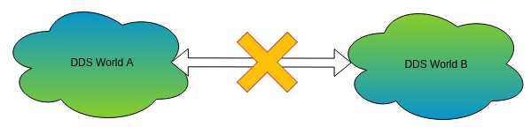
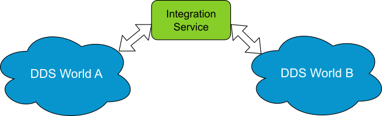
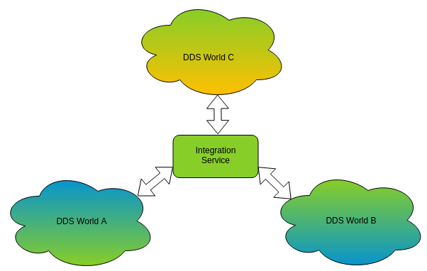

Communicate two DDS applications
================================

The domain field is used to define the local space where participants exist. With this information, several
DDS applications that use different domains can't communicate between them, even if they use compatible types
and configurations.
To make this communication doable it could be possible to change the domain of one application to move all of
them to the same domain, but this modification may be undesired.
In these cases, Integration Service can create a bridge between them, keeping each application with its configuration.

*Integration Service* can configure two *endpoints* to establish the communication with the rest of applications
directly and without changing its configuration, sending the packages of one domain to the other one.

Routing usage and configuration
-------------------------------

To solve the previous situation, *Integration Service* must be configured through its XML :ref:`configuration` file with
one endpoint able to write and read to each *DDS world*. Depending on the *Topic Data Type* of each *DDS world*,
a :ref:`Transformation Library` could be needed to provide *transformation functions* that will convert the data from
*DDS World A* to *DDS World B* and vice versa. See :ref:`Data Transformation` to see a scenario with
*transformation functions*.

In this example, a file named :class:`config.xml` needs to be created.

The *endpoints* must be configured in the :ref:`Fast-RTPS profiles` section.

.. literalinclude:: config_comms_dds.xml
    :language: XML
    :start-after: <!-- fast-rtps profiles -->
    :end-before: <!-- end fast-rtps profiles -->

And the :ref:`Connectors` are declared below:

.. literalinclude:: config_comms_dds.xml
    :language: XML
    :start-after: <!-- connectors -->
    :end-before: <!-- end connectors -->

It's important to associate the correct *participant* with the correct *publisher* or *subscriber*, in this case:
:class:`publisher A` and :class:`subscriber A` *endpoints* belong to :class:`DDS World A` *participant*, and
:class:`publisher B` and :class:`subscriber B` *endpoints* belong to :class:`DDS World B` *participant*.

The root tag of the :class:`config.xml` file must be ``<is>`` as described in the :ref:`configuration`.

Routing with Integration Service
--------------------------------

As both *DDS Worlds* use the same protocol, and *Integration Service* supports it out-of-the-box,
the protocol level doesn't need any change to perform the communication.

Once the file :class:`config.xml` has been created, *IS* is able to run and start the communication of both *DDS Worlds*.

.. code-block:: bash

    $ integration_service config.xml

Creating new routes
-------------------

With the knowledge acquired after studying and solving this scenario, it could be possible to add new connectors between both
*DDS Worlds* or other *DDS World* (like a new *DDS World C* for example) following this steps:

- Create and configure the needed :ref:`Fast-RTPS profiles` in the XML configuration file.
- Create the needed :ref:`Connectors` in the XML configuration file.
- Executing *IS* with the XML configuration file.

Domain Change Example
---------------------

This example shows how *IS* can communicate two *participants* that belong to different *domains*.

To properly execute the example, it's mandatory to compile it from the `domain_change example location <https://github.com/eProsima/Integration-Service/tree/master/examples/domain_change>`_.

Linux:

.. code-block:: bash

    $ mkdir build
    $ cd build
    $ cmake ..
    $ make

Windows:

.. code-block:: bash

    $ mkdir build
    $ cd build
    $ cmake -G "Visual Studio 14 2015 Win64" ..
    $ cmake --build .

The compilation will generate an example application named *DomainChange* in the build directory.
After executing *DomainChange* as a publisher, it will create its *participant* in *domain* **0**,
and after launching *DomainChange* as a subscriber, it will create its *participant* in *domain* **5**.

The command to launch *DomainChange* as a publisher is:

.. code-block:: bash

    $ ./DomainChange publisher

And to launch it as a subscriber:

.. code-block:: bash

    $ ./DomainChange subscriber

As both instances are bound to different *domains*, the applications will not communicate.
But once after launching IS with the `config.xml <https://github.com/eProsima/Integration-Service/blob/master/examples/domain_change/config.xml>`__ that comes with the example, both *DomainChange* instances will begin to communicate.

In another terminal:

.. code-block:: bash

    $ cd <path_to_is_source>/examples/domain_change
    $ integration_service config.xml

This schema shows the internal flow of this example:

.. image:: DomainChange.png
    :align: center
