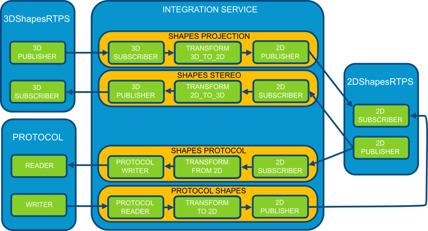

Configuration
=============

Load configuration
------------------

*Integration Service* must receive an argument with the XML file with the configuration to load.

.. code-block:: bash

    $ integration_service config.xml

With this file, *Integration Service* creates all the components needed to do its job.

Configuration format
--------------------

This XML file can contain the following sections, all inside a root :class:`<is>` label.

.. literalinclude:: configuration.xml
    :language: xml
    :start-after: <!-- Configuration Format Start -->
    :end-before: <!-- Configuration Format End -->
    :dedent: 4

IS Types configuration
----------------------

The *IS Types* section allows to specify what topic data types will be loaded through :ref:`types library` and define
topic data types with `Fast RTPS XML Types <http://docs.eprosima.com/en/latest/dynamictypes.html#xml-dynamic-types>`__.

A Data Type that uses Keys needs a :ref:`types library` to instantiate it.

In most cases, there is no need to implement a :ref:`types library`.
*IS* will use :class:`GenericPubSubType` by default which encapsulates any Data Type without Keys defined.

This section uses `Fast RTPS Dynamic Types <http://docs.eprosima.com/en/latest/dynamictypes.html>`__ internally,
but it's available to use them by code using the *Fast RTPS* API in a :ref:`types library` or using
`Fast-RTPS XML Types <http://docs.eprosima.com/en/latest/dynamictypes.html#xml-dynamic-types>`__.

.. literalinclude:: configuration.xml
    :language: xml
    :start-after: <!-- IS Types Start -->
    :end-before: <!-- IS Types End -->
    :dedent: 4

This XML example shows how to define :ref:`types library` for each type like :class:`ShapeType` and
:class:`libshape.so`, or use a default library that will try to load the rest of types
(:class:`libdefault.so` in the example).

*IS* will use :class:`GenericPubSubType` to manage any Data Type that isn't declared through
*Fast-RTPS XML Types* and can't instantiate from any :ref:`Types Library`.

If the ``<is_types>`` section doesn't exist *IS* will use :class:`GenericPubSubType` to manage all Data Types
declared in the :ref:`Fast-RTPS profiles` section.

Fast-RTPS profiles
------------------

The profiles section defines *participants*, *subscribers*, *publishers*, etc. following the format used by
`Fast RTPS XML Types <http://docs.eprosima.com/en/latest/dynamictypes.html#xml-dynamic-types>`__,
with its configuration.

.. literalinclude:: configuration.xml
    :language: xml
    :start-after: <!-- Profiles Start -->
    :end-before: <!-- Profiles End -->
    :dedent: 4

Connectors
----------

The *connectors* are just relationships between *readers* and *writers*, and optionally, a *transformation function*.
*IS* needs at least one *connector* to perform work, but the *XML configuration file* allows to define any
number of *connectors*.
They must contain a *reader* and a *writer*.
Each of them is configured by a *participant* or *bridge* name and the *reader's* or *writer's* name respectively.

The following example defines a *connector* whose reader is a *Fast-RTPS's subscriber* and whose *writer*
prints the received data into a text file.
Also, the connector defines a function from a :ref:`transformation library` that adds the timestamp to the data.

.. literalinclude:: configuration.xml
    :language: xml
    :start-after: <!-- Basic Connector Start -->
    :end-before: <!-- Basic Connector End -->
    :dedent: 4

There are several possible types of *connectors* depending on the kind of its *participants*.
Each *connector* type will refer to the bottom :ref:`example`.

RTPS Connector
^^^^^^^^^^^^^^

In this kind of *connector*, both *participants* are *RTPS* compliant,
like *shapes_projection* and *shapes_stereo* in the :ref:`example` file.

.. literalinclude:: configuration.xml
    :language: xml
    :start-after: <!-- RTPS Connector Start -->
    :end-before: <!-- RTPS Connector End -->
    :dedent: 4

Connector from RTPS to Other protocol
^^^^^^^^^^^^^^^^^^^^^^^^^^^^^^^^^^^^^

This *connector* will communicate an *RTPS* environment with another protocol.
Just like the *shapes_protocol* connector in the :ref:`example`.

The *Bridge Library* must define at least a *writer*, following the ``ISWriter`` interface, responsible for
communicate with the desired protocol.
By default, the ``ISBridge's`` :class:`on_received_data` method applies the *transformation function* internally.
It's mandatory to override the complete data flow to change this behavior.

.. image:: RTPS_other_connector.png
    :align: center

.. literalinclude:: configuration.xml
    :language: xml
    :start-after: <!-- RTPS To other connector Start -->
    :end-before: <!-- RTPS To other connector End -->
    :dedent: 4

Connector from Other protocol to RTPS
^^^^^^^^^^^^^^^^^^^^^^^^^^^^^^^^^^^^^

This case is the opposite *connector* that the previous one,
as in the *connector* :class:`protocol_shapes` of the example.

The same logic applies in this *connectors* as in the :ref:`Connector from RTPS to Other protocol` case,
but in this case, the RTPS participant is the *writer*.
`FIROS2 <https://github.com/eProsima/FIROS2/tree/master/examples/helloworld_ros2>`__ has an example of this connector.

.. literalinclude:: configuration.xml
    :language: xml
    :start-after: <!-- Other connector to RTPS Start -->
    :end-before: <!-- Other connector to RTPS End -->
    :dedent: 4

Bidirectional connector
^^^^^^^^^^^^^^^^^^^^^^^

This case is not a *connector*, but the consequence of setting two *connectors* with the correct parameters.
In the :ref:`example`, the combination of *shapes_projection* and *shapes_stereo* is a bidirectional *connector*,
as well as, *shapes_protocol* and *protocol_shapes*.

A combination of both logics :ref:`Connector from RTPS to Other protocol` and :ref:`Connector from Other protocol to RTPS` applies here.
The example `TIS_NGSIv2 <https://github.com/eProsima/FIROS2/tree/master/examples/TIS_NGSIv2>`__ of *FIROS2* uses a
bridge of this type.

.. image:: Bidirectional_connector.png
    :align: center

.. literalinclude:: configuration.xml
    :language: xml
    :start-after: <!-- Bidirectional connector Start -->
    :end-before: <!-- Bidirectional connector End -->
    :dedent: 4

Bridge configuration
--------------------

Bridge sections allow defining new *endpoints* to implement new protocols.
Inside the tag ``<bridge>``, a :ref:`bridge library` must be defined.
It contains the methods to create the *bridge* (implementing :ref:`isbridge`),
*writers* (implementing :ref:`iswriter`) and *readers* (implementing :ref:`isreader`).
If any of them uses the default implementation, its method can simply return :class:`nullptr`.

Inside the ``<bridge>``, ``<writer>`` and ``<reader>`` can be defined ``<properties>``.
They are pairs ``<name>`` and ``<value>`` to configure the elements
that can be accessible to the elements in code, without affecting the XML parsing.
The next example shows how to create some *properties* to create attributes for
the *bridge* and some to configure a *writer*.
Each property set will be sent to its component as a vector of pairs of strings, and if no *properties* are provided,
then the :class:`create_` method will be called with :class:`nullptr` or an empty vector as parameter config.

.. literalinclude:: configuration.xml
    :language: xml
    :start-after: <!-- Bridge Start -->
    :end-before: <!-- Bridge End -->
    :dedent: 4

The complete explanation about *bridges* and their API are available :ref:`here <Bridge Library>`.

Writer configuration
^^^^^^^^^^^^^^^^^^^^

The ``<writer>`` section exposes *writer* classes of the *bridge library* to be used by *Integration Service*.
The only mandatory field is the ``<name>`` of the class, and with it, *Integration Service*
is able to create instances of the *writer* when :ref:`connectors` need them.

The complete explanation about *writers* and their API are available :ref:`here <ISWriter>`.

Reader configuration
^^^^^^^^^^^^^^^^^^^^

The ``<reader>`` section exposes *reader* classes of the *bridge library* to be used by *Integration Service*.
The only mandatory field is the ``<name>`` of the class, and with it, *Integration Service*
is able to create instances of the *reader* when :ref:`connectors` need them.

The complete explanation about *readers* and their API are available :ref:`here <ISReader>`.

IS Libraries
------------

There are three different kind of libraries that *Integration Service* manages:

- **Type Library**: It defines the types and the methods that allow creating these types. More details about *Types Library* configuration is available in the :ref:`IS Types configuration` section and a deeper explanation in the :ref:`Types library` section.

- **Transformation Library**: *Transformation libraries* stores functions to manage the input and output data communicating a *reader* and a *writer* of a :ref:`connector <Connectors>`. A deeper explanation is available in the :ref:`Transformation library` section.

- **Bridge Library**: It includes the code to manage *endpoints* to implement new protocols. Its configuration is explained inside :ref:`Bridge configuration` and the complete description of *bridges*, and their API is available in the :ref:`ISBridge` section.

Example
-------

In this file, there are defined two RTPS *participants* and a *bridge*.
Both *participants* and the *bridge* have a *subscriber* and a *publisher*.
Each *connector*  defines the relationships between *participants* and *subscribers*/*publishers*,
allowing sharing *subscribers*/*publishers* configurations between *participants*.
There are four *connectors* defined: *shapes_projection*, *shapes_stereo*, *shapes_protocol*, and *protocol_shapes*.

.. literalinclude:: configuration.xml
    :language: xml
    :start-after: <!-- IS Libraries Start -->
    :end-before: <!-- IS Libraries End -->
    :dedent: 4
