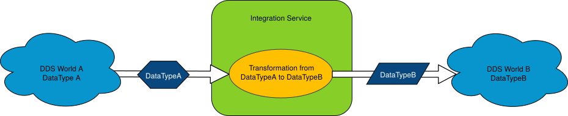

Dynamic Data Integration
========================

*Fast-RTPS 1.7.0* includes *Dynamic Data Types* and *XML Types* as new features.
*Integration Service* benefits from these features allowing to integrate *Dynamic Data Types* for the transformation of data types.

This *use case* illustrates a scenario using both types of *Dynamic Data* declarations
(*Dynamic Data Types* and *XML Types*) and a *transformation function*.
For a full *use case* explaining *transformation functions*, you can see :ref:`Data transformation` section.

The following image shows the data flow through a *transformation function*.

Dynamic Data usage and configuration
------------------------------------

There are two ways to declare *Dynamic Data Types* in *Integration Service*.
They could be created using :ref:`IS Types Libraries <Types Library>`, or they can be declared directly as
:ref:`Fast-RTPS XML Types <IS Types configuration>` in the :ref:`XML configuration file <configuration>`.

.. literalinclude:: configuration.xml
    :language: xml
    :start-after: <!-- IS Types Start -->
    :end-before: <!-- IS Types End -->
    :dedent: 4

This example needs to define two *Dynamic Data Types*: :class:`TypeA` and :class:`TypeB`, that will be used to
communicate the *DDS World A* with *DDS World B*, applying a *transformation function*, that will be the typical scenario.

The first step is creating the XML configuration file to indicate which library implements each data type.
In this case, both types :class:`TypeA` and :class:`TypeB` will be implemented in the same library.

.. literalinclude:: dynamic_case.xml
    :language: xml
    :start-after: <!-- IS Types Start -->
    :end-before: <!-- IS Types End -->

Then, in the :ref:`Fast-RTPS profiles` section, the *publisher* and *subscriber* can refer the data types by name.

.. literalinclude:: dynamic_case.xml
    :language: xml
    :start-after: <!-- Profiles Start -->
    :end-before: <!-- Profiles End -->

And finally it needs a :ref:`Connector <Connectors>` to relate all the components:

.. literalinclude:: dynamic_case.xml
    :language: xml
    :start-after: <!-- Connector Start -->
    :end-before: <!-- Connector End -->
    :dedent: 4

As this scenario focus on *Dynamic Topic Data*, it isn't going to explain how to create the
:ref:`transformation library`, but there is a complete *use case* about it in :ref:`Data transformation` section.

Dynamic Data with Integration Service
-------------------------------------

As explained in the previous section, there are two ways to declare *Dynamic Data Types* in *IS*.
Using :ref:`Fast-RTPS XML Types <IS Types configuration>`, there is no need to perform any additional
step, and the *Data Types* will be available to use them directly.
And using a :ref:`Types Library`, it's mandatory to implement the library and build it.

In this example, the name of the library is going to be :class:`libtypeatypeb.so`, and at least it must
implement the function ``GetTopicType``. There is a template file *typeslib.cpp* in resources folder in the *IS* repository.

This part of the example shows the full process to create a *Types Library*.
The source file is going to be named :class:`typeatypeb.cpp`.

Firstly it needs to include all required headers to use *Fast-RTPS Dynamic Types*.

.. literalinclude:: dynamic_case.cpp
    :language: cpp
    :start-after: // Include Start
    :end-before: // Include End

.. _cmake_definitions_code_dynamicdata:

The next part is optional, but it helps to make the library portable between different
operating systems and keeps the source code clear to read.
Additionally, in this case, may be useful to add some ``using namespaces``.

.. literalinclude:: dynamic_case.cpp
    :language: cpp
    :start-after: // Define Start
    :end-before: // Define End

This optional section should be taken in mind during the creation of the *CMakeLists.txt* file to configure the project.

Usually, it's useful to create auxiliary functions to generate each type of data.

To create DataTypeA:

.. literalinclude:: dynamic_case.cpp
    :language: cpp
    :start-after: // DataTypeA Start
    :end-before: // DataTypeA End

To create DataTypeB:

.. literalinclude:: dynamic_case.cpp
    :language: cpp
    :start-after: // DataTypeB Start
    :end-before: // DataTypeB End

And after the creation of these functions, the next step is filling the ``GetTopicType`` function
to return an instance of the declared types:

.. literalinclude:: dynamic_case.cpp
    :language: cpp
    :start-after: // GetTopicType Start
    :end-before: // GetTopicType End

After that, the *types library* is implemented, but it needs to be built.
*Integration Service* provides a *CMakeLists.txt* template that can be used as in this example.

The first step is renaming the cmake project to *typeatypeb*.

.. literalinclude:: dynamic_case_CMake.txt
    :language: cmake
    :lines: 1

It's recommendable to keep all *C++11* and *CMake* version as it is but to create the *CMakeLists.txt* from scratch,
it's important to keep in mind that *FastRTPSGen* generates files that depend on *Fast CDR* and *Fast RTPS*,
so they must be included as dependencies to the *CMakeLists.txt*.

.. literalinclude:: dynamic_case_CMake.txt
    :language: cmake
    :start-after: # packages
    :lines: 1,2

To make the library more portable the cmake file needs to add the
:ref:`preprocessor definitions <cmake_definitions_code_dynamicdata>` to build the library exporting symbols.

.. literalinclude:: dynamic_case_CMake.txt
    :language: cmake
    :start-after: # definitions
    :lines: 1-4

The final step is indicating to *CMake* the source code files and the library to build, along with its dependencies.

.. literalinclude:: dynamic_case_CMake.txt
    :language: cmake
    :start-after: # typeatypeb library
    :lines: 1-3

After that, *CMake* will generate the library running these commands:

.. code-block:: bash

    $ cmake .
    $ make

It should generate the file *libtypeatypeb.so* in the current directory, and that's the library that
*IS* expects when loads the :class:`config.xml` file.

This example needs a :ref:`transformation library` too. There is a complete *use case* about *transformation libraries* in :ref:`Data transformation` section.

At this point, there is a configuration file :class:`config.xml` created, and a *types library*
*libtypeatypeb.so* built. *Integration Service* now allows generating both dynamic types and connect two *DDS Worlds* adapting their data types to be compatible.

.. code-block:: bash

    $ integration_service config.xml

Creating new Dynamic Data
-------------------------

The steps needed to define *types libraries* to create *Dynamic Data Types* are:

- Create and configure the needed :ref:`IS Types configuration` in an XML configuration file.
- Create and configure the needed :ref:`Fast-RTPS profiles` in the XML configuration file.
- Create the needed :ref:`Connectors` in the configuration file.
- Implementing a custom :ref:`Types Library`, if needed.
- Generating a *types library* binary, if needed.
- Executing *IS* with the XML configuration file.

Dynamic Types example
---------------------

There is an example implemented in the
`dynamic_types example  <https://github.com/eProsima/Integration-Service/tree/master/examples/dynamic_types>`_
where you can see the use of dynamic types.

.. code-block:: bash

    $ mkdir build
    $ cd build
    $ cmake ..
    $ make

Windows:

.. code-block:: bash

    $ mkdir build
    $ cd build
    $ cmake -G "Visual Studio 14 2015 Win64" ..
    $ cmake --build .

This example allows the communication between the
`HelloWorldExample <https://github.com/eProsima/Fast-RTPS/tree/master/examples/C++/HelloWorldExample>`_ and the
`Keys <https://github.com/eProsima/Fast-RTPS/tree/master/examples/C++/Keys>`_ examples from FastRTPS.
HelloWorldExample must be started as a publisher and the Keys example as a subscriber.

.. code-block:: bash

    $ ./HelloWorldExample publisher

And in another terminal:

.. code-block:: bash

    $ ./keys subscriber

In this step, both applications don't have any communication between them,
and after starting the *Integration Service* with the given configuration file,
the communication will be started. *dyn_dyn_config[_win].xml* uses *Dynamic Types* in both flavors.

.. code-block:: bash

    $ ./integration_service dyn_dyn_config_win.xml
