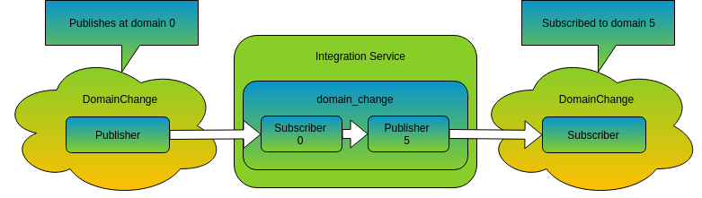
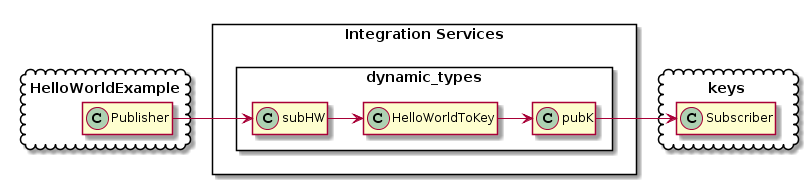
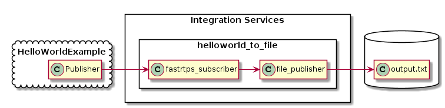
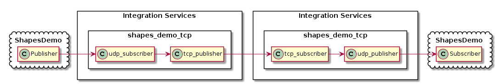

Examples
========

Integration Service (IS) ships with a folder with examples. In addition, exists another project derived from IS
named `FIROS2 <https://github.com/eProsima/FIROS2>`_ with more examples.

All these examples suppose that you have IS already installed.
In IS you can find the following examples:

Domain Change
^^^^^^^^^^^^^

This example shows how IS can communicate two participants that belongs to different domains.

To execute the example properly, we must first compile the example itself, from the `domain_change example location <https://github.com/eProsima/Integration-Service/tree/feature/TCP_DynTypes/examples/domain_change>`_.

Linux:

::

    $ mkdir build
    $ cd build
    $ cmake ..
    $ make

Windows:

::

    $ mkdir build
    $ cd build
    $ cmake -G "Visual Studio 14 2015 Win64" ..
    $ cmake --build .

The compilation will generate an example application named *DomainChange* in build directory.
When we execute *DomainChange* as publisher, it will create its participant in the domain **0**.
If we launch *DomainChange* as subscriber, it will create its participant in the domain **5** instead.

Now, we must launch *DomainChange* in both setups:

::

    $ ./DomainChange publisher

And in another terminal:

::

    $ ./DomainChange subscriber

As both instances are bound to different domains, the applications will not communicate.
But once we launch IS with the `config.xml <https://github.com/eProsima/Integration-Service/blob/feature/TCP_DynTypes/examples/domain_change/config.xml>`__ that comes with the example, both *DomainChange* instances will begin to communicate.

On another terminal:

::

    $ cd <path_to_is_source>/examples/domain_change
    $ integration_service config.xml

Here, we can see a schema that represents the internal flow in this example.

Dynamic Types
^^^^^^^^^^^^^

**Introduction**

In this example, IS makes use of both, static and dynamic types, showing the different mechanism to define types
supported by IS.

In this case, there are two configuration files provided with the example, `static_static_config.xml <https://github.com/eProsima/Integration-Service/blob/feature/TCP_DynTypes/examples/dynamic_types/static_static_config.xml>`_ and `dyn_dyn_config.xml <https://github.com/eProsima/Integration-Service/blob/feature/TCP_DynTypes/examples/dynamic_types/dyn_dyn_config.xml>`_.

*static_static_config.xml* uses the library `keyhelloworld_static_static_lib <https://github.com/eProsima/Integration-Service/blob/feature/TCP_DynTypes/examples/dynamic_types/keyhelloworld_static_static_lib.cpp>`_ that allow us to instantiate and interact with static versions of HelloWorld and samples (from KeysExample of Fast-RTPS) data types.

*dyn_dyn_config.xml* uses instead the library `keyhelloworld_dyn_dyn_lib <https://github.com/eProsima/Integration-Service/blob/feature/TCP_DynTypes/examples/dynamic_types/keyhelloworld_dyn_dyn_lib.cpp>`_ that do the same, but with dynamic versions. In this library you can see how dynamic types can be defined programatically, and in the configuration file, how they can be defined through xml. For more information about DynamicTypes read the Fast-RTPS documentation.

HelloWorld and samples types are not directly compatible, so our library must apply a transformation function,
in this case, to transforms from HelloWorld to samples. The other transformation is also implemented if you want to
reverse the communication (remember to change the connector too and launch Keys as publisher and HelloWorldExample as subscriber).

.. code-block:: cpp

    extern "C" USER_LIB_EXPORT void HelloWorldToKey(DynamicData* hwData, DynamicData* keysData)
    {
        // Custom transformation
        uint32_t temp = hwData->GetUint32Value(0);
        keysData->SetByteValue(temp % 256, 0);
        keysData->SetByteValue(temp % 256, 1);
    }

Static versions (configuration file and library) are included to ease comparation with their dynamic counterpart, but the example will focus in the dynamic versions.

**Preparation**

You need to have `HelloWorldExample <https://github.com/eProsima/Fast-RTPS/tree/master/examples/C%2B%2B/HelloWorldExample>`_ and `Keys <https://github.com/eProsima/Fast-RTPS/tree/master/examples/C%2B%2B/Keys>`_ from Fast-RTPS already compiled.

Then, you must compile the example itself, from the `dynamic_types example location <https://github.com/eProsima/Integration-Service/tree/feature/TCP_DynTypes/examples/dynamic_types>`_.

Linux:

::

    $ mkdir build
    $ cd build
    $ cmake ..
    $ make

Windows:

::

    $ mkdir build
    $ cd build
    $ cmake -G "Visual Studio 14 2015 Win64" ..
    $ cmake --build .

The build process will generate the binaries of the two libraries.

**Execution**

In one terminal, launch HelloWorldExample as publisher:

::

    $ HelloWorldExample publisher

In another terminal, launch Keys example as subscriber:

::

    $ keys subscriber

Finally, launch IS in another terminal with *dyn_dyn_config.xml* (*dyn_dyn_config_win.xml* if you are on Windows) file from the example folder:

Linux:

::

    $ cd <path_to_is_source>/examples/dynamic_types
    $ integration_service dyn_dyn_config.xml

Windows:

::

    $ cd <path_to_is_source>/examples/dynamic_types
    $ integration_service dyn_dyn_config_win.xml

Once IS is running, both examples will start to communicate.

HelloWorld to file
^^^^^^^^^^^^^^^^^^

**Introduction**

In this example we create a new bridge to save all received data from the Fast-RTPS HelloWorldExample into a file.

To achieve that target, we need the bridge library `isfile <https://github.com/eProsima/Integration-Service/blob/feature/TCP_DynTypes/examples/helloworld_to_file/isfile.cpp>`_.
The library only instantiates `FilePublisher <https://github.com/eProsima/Integration-Service/blob/feature/TCP_DynTypes/examples/helloworld_to_file/FilePublisher.cpp>`_ that implements the logic to save the data to a file.

The `config.xml <https://github.com/eProsima/Integration-Service/blob/feature/TCP_DynTypes/examples/helloworld_to_file/config.xml>`__ file of the example configures IS with the bridge library in a connector that receives data from HelloWorldExample.

**Preparation**

You need to have `HelloWorldExample <https://github.com/eProsima/Fast-RTPS/tree/master/examples/C%2B%2B/HelloWorldExample>`_ from Fast-RTPS already compiled.

Then, you must compile the example itself, from the `helloworld_to_file example location <https://github.com/eProsima/Integration-Service/tree/feature/TCP_DynTypes/examples/helloworld_to_file>`_.

Linux:

::

    $ mkdir build
    $ cd build
    $ cmake ..
    $ make

Windows:

::

    $ mkdir build
    $ cd build
    $ cmake -G "Visual Studio 14 2015 Win64" ..
    $ cmake --build .

The build process will generate the binary of the bridge library.

**Execution**

In one terminal, launch HelloWorldExample as publisher:

::

    $ HelloWorldExample publisher

Launch IS in another terminal with the *config.xml* (*config_win.xml* if you are on Windows) file from the example folder:

Linux:

::

    $ cd <path_to_is_source>/examples/helloworld_to_file
    $ integration_service config.xml

Windows:

::

    $ cd <path_to_is_source>/examples/helloworld_to_file
    $ integration_service config_win.xml

Once IS is running, HelloWorldExample will match and a file named *output.txt* will be created with the received data
from HelloWorldExample.

Shapes Demo TCP
^^^^^^^^^^^^^^^

**Introduction**

In this example we configure IS to use a TCP tunnel to communicate two Fast-RTPS ShapesDemo in different ways.

There are included several configuration files:

- `config_client.xml <https://github.com/eProsima/Integration-Service/blob/feature/TCP_DynTypes/examples/shapes_demo_tcp/config_client.xml>`__: Configures IS as a TCP client and acts as a shapes publisher.

- `config_server.xml <https://github.com/eProsima/Integration-Service/blob/feature/TCP_DynTypes/examples/shapes_demo_tcp/config_server.xml>`__: Configures IS as a TCP server and acts as a shapes subscriber.

- `config.xml <https://github.com/eProsima/Integration-Service/blob/feature/TCP_DynTypes/examples/shapes_demo_tcp/config.xml>`__: Configures two IS connectors, one like config_client and the other as config_server.

*config.xml* is intended to execute this test using one machine, and client plus server versions, to allow executions on
different machines.

In our case, we will use *config.xml* to test it in one machine.

The example uses a types library named `shapelib <https://github.com/eProsima/Integration-Service/blob/feature/TCP_DynTypes/examples/shapes_demo_tcp/shapelib.cpp>`__ that allow us to create the keyed type "shape" that ShapesDemo uses to communicate.

To allow execute the example in the same machine, each ShapesDemo instance will be bound to different domains,
allowing IS to do some useful work.

**Preparation**

You need to have a `ShapesDemo <https://github.com/eProsima/ShapesDemo>`__ working.

Then, you must compile the example itself, from the `shapes_demo_tcp example location <https://github.com/eProsima/Integration-Service/tree/feature/TCP_DynTypes/examples/shapes_demo_tcp>`_.

Linux:

::

    $ mkdir build
    $ cd build
    $ cmake ..
    $ make

Windows:

::

    $ mkdir build
    $ cd build
    $ cmake -G "Visual Studio 14 2015 Win64" ..
    $ cmake --build .

The build process will generate the binary of the types library.

**Execution**

In two different terminals, launch ShapesDemo:

::

    $ ShapesDemo

In one of the ShapesDemo, change the domain in its configuration window to **1**. Then publish some shape.

In the other ShapesDemo, subscribe to that kind of shape.

The *subscriber* ShapesDemo shouldn't received any data as they belong to different domains.

Launch IS in another terminal with the *config.xml* (*config_win.xml* if you are on Windows) file from the example folder:

Linux:

::

    $ cd <path_to_is_source>/examples/shapes_demo_tcp
    $ integration_service config.xml

Windows:

::

    $ cd <path_to_is_source>/examples/shapes_demo_tcp
    $ integration_service config_win.xml

Once IS is running, both ShapesDemo must start to communicate and the *subscriber* ShapesDemo should begin to receive
data from the *publisher*

