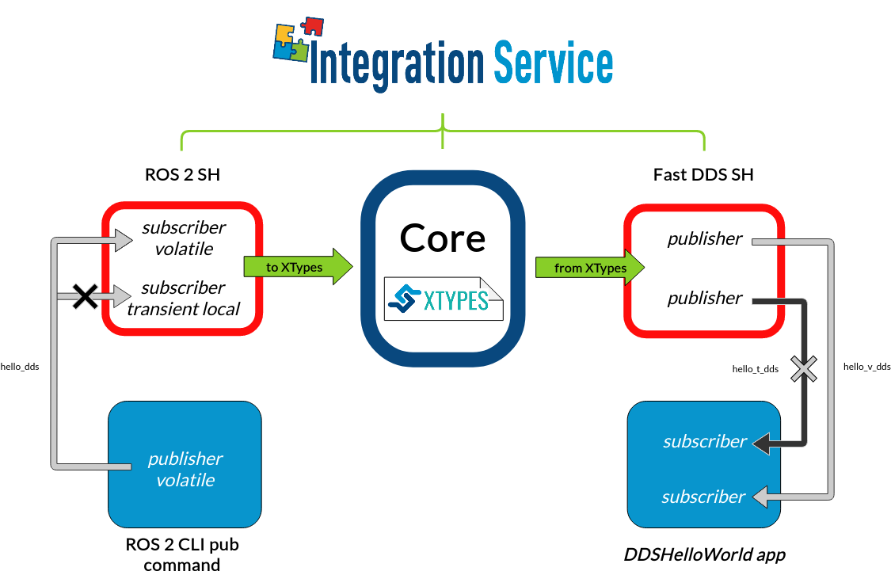

.. _dds_ros2_qos_pubsub:

DDS - ROS 2 using QoS
=====================

In this example, we show how to use Quality of Service policies within *ROS 2* entities using *Integration Service*.
To do so, we use a widely extended case in the robotics world: the bridge between *DDS* and *ROS 2*.
Specifically, we discuss how to do so with the *Fast DDS* implementation.

A user with knowledge of *ROS 2* systems can know how the QoS are applied and what effect they would have on each of
the entities. But in this case, we are going to explain how the YAML file should be configured so that these QoS are
made effective in the internal entities of *Integration Service*.

The steps described below address such a situation, by putting into communication a *ROS 2 CLI* publisher,
using compatible and incompatible QoS on each case, with the *Fast DDS* :code:`DDSHelloWorld` example.

.. _dds-ros2-qos_requirements:

Requirements
^^^^^^^^^^^^

To prepare the deployment and setup the environment, you need to have *Integration Service*
correctly installed in your system.
To do so, please follow the steps delineated in the :ref:`installation` section.

Also, to get this example working, the following requirements must be met:

* Having **ROS 2** (*Foxy* or superior) installed.

* Having the **ROS 2 System Handle** installed. You can download it from the
  `ROS2-SH dedicated repository <https://github.com/eProsima/ROS2-SH>`_ into the :code:`is-workspace`
  where you have *Integration Service* installed:

  .. code-block:: bash

      cd ~/is-workspace
      git clone https://github.com/eProsima/ROS2-SH.git src/ROS2-SH

* Having **Fast DDS** (*v.2.0.0* or superior) installed and the *Integration Service*
  :code:`DDSHelloWorld` example working.
  This example can be found in the main *Integration Service* repository, under the
  `examples/utils/dds/DDSHelloWorld <https://github.com/eProsima/Integration-Service/tree/main/examples/utils/dds/DDSHelloWorld>`_ folder;
  to compile it, you can either compile the whole *Integration Service* project using :code:`colcon` with the *CMake* flag
  :code:`BUILD_FASTDDS_EXAMPLES` enabled; or execute the following steps:

  .. code-block:: bash

    cd ~/is-workspace/src/Integration-Service/examples/utils/dds/DDSHelloWorld
    mkdir build && cd build
    cmake .. -DBUILD_EXAMPLES=ON && make

* Having the **Fast DDS System Handle** installed. You can download it from the
  `FastDDS-SH dedicated repository <https://github.com/eProsima/FastDDS-SH>`_
  into the :code:`is-workspace` where you have *Integration Service* installed:

  .. code-block:: bash

      cd ~/is-workspace
      git clone https://github.com/eProsima/FastDDS-SH.git src/FastDDS-SH

After you have everything correctly installed in your :code:`is-workspace`, build the packages by running:

.. code-block:: bash

   cd ~/is-workspace
   colcon build --cmake-args -DBUILD_FASTDDS_EXAMPLES=ON

Deployment
^^^^^^^^^^

Below we explain how to deploy this example of communication with compatible and incompatible durability QoS.
The YAML used for this example consist of a *ROS 2* publisher that send messages on the topic :code:`hello_dds`.
Depending on its durability kind that messages are redirected using *Integration Service* to the topic
:code:`hello_v_dds` if it compatible with :code:`volatile` subscribers and to the topic :code:`hello_t_dds` if it is
compatible with :code:`transient_local` subscribers.

ROS 2 transient local CLI publisher to DDS subscribers
------------------------------------------------------

To enable communication from *ROS 2* to *Fast DDS*, open four terminals:

* In the first terminal, source your *ROS 2* installation and execute a *ROS 2 CLI* publication instruction with
  durability :code:`transient_local`:

  .. code-block:: bash

      source /opt/ros/$<ROS2_DISTRO>/setup.bash
      ros2 topic pub /hello_dds std_msgs/msg/String "{ data: 'Hello' }" --qos-durability transient_local

* In the second terminal, execute a *Fast DDS* HelloWorld :code:`subscriber` on the topic :code:`hello_v_dds`
  from within the :code:`is-workspace`:

  .. code-block:: bash

      cd ~/is-workspace
      source install/setup.bash
      ./build/is-examples/dds/DDSHelloWorld/DDSHelloWorld -m subscriber -n hello_v_dds

* In the third terminal, execute another *Fast DDS* HelloWorld :code:`subscriber` on the topic :code:`hello_t_dds`
  from within the :code:`is-workspace`:

  .. code-block:: bash

      cd ~/is-workspace
      source install/setup.bash
      ./build/is-examples/dds/DDSHelloWorld/DDSHelloWorld -m subscriber -n hello_t_dds

At this point, the three applications cannot communicate due to the incompatibility of their *topics* and *types*.
This is where *Integration Service* comes into play to make the communication possible.

* In the third terminal, go to the :code:`is-workspace` folder, source the *ROS 2* and local installations,
  and execute *Integration Service* with the :code:`integration-service` command followed by the
  `fastdds_ros2__qos_helloworld.yaml <https://github.com/eProsima/Integration-Service/blob/main/examples/basic/fastdds_ros2__qos_helloworld.yaml>`_
  configuration file located in the :code:`src/Integration-Service/examples/basic` folder:

  .. code-block:: bash

      cd ~/is-workspace
      source /opt/ros/$<ROS2_DISTRO>/setup.bash
      source install/setup.bash
      integration-service src/Integration-Service/examples/basic/fastdds_ros2__qos_helloworld.yaml

Once the last command is executed, the three applications will start communicating, since the :code:`transient_local`
durability defined for the *ROS 2* publisher is compatible with :code:`volatile` and :code:`transient_local` subscribers.
The following diagram describes the data flow between all the involved applications.

ROS 2 volatile CLI publisher to DDS subscriber
----------------------------------------------

To enable communication from *Fast DDS* to *ROS 2*, open four terminals:

* In the first terminal, source your *ROS 2* installation and execute a *ROS 2 CLI* publication instruction with
  durability :code:`volatile`:

  .. code-block:: bash

      source /opt/ros/$<ROS2_DISTRO>/setup.bash
      ros2 topic pub /hello_dds std_msgs/msg/String "{ data: 'Hello' }" --qos-durability volatile

* In the second terminal, execute a *Fast DDS* HelloWorld :code:`subscriber` on the topic :code:`hello_v_dds`
  from within the :code:`is-workspace`:

  .. code-block:: bash

      cd ~/is-workspace
      source install/setup.bash
      ./build/is-examples/dds/DDSHelloWorld/DDSHelloWorld -m subscriber -n hello_v_dds

* In the third terminal, execute another *Fast DDS* HelloWorld :code:`subscriber` on the topic :code:`hello_t_dds`
  from within the :code:`is-workspace`:

  .. code-block:: bash

    cd ~/is-workspace
    source install/setup.bash
    ./build/is-examples/dds/DDSHelloWorld/DDSHelloWorld -m subscriber -n hello_t_dds

At this point, the three applications cannot communicate due to the incompatibility of their *topics* and *types*.
This is where *Integration Service* comes into play to make the communication possible.

* In the third terminal, go to the :code:`is-workspace` folder, source the *ROS 2* and local installations,
  and execute *Integration Service* with the :code:`integration-service` command followed by the
  `fastdds_ros2__qos_helloworld.yaml <https://github.com/eProsima/Integration-Service/blob/main/examples/basic/fastdds_ros2__qos_helloworld.yaml>`_
  configuration file located in the :code:`src/Integration-Service/examples/basic` folder:

  .. code-block:: bash

      cd ~/is-workspace
      source /opt/ros/$<ROS2_DISTRO>/setup.bash
      source install/setup.bash
      integration-service src/Integration-Service/examples/basic/fastdds_ros2__helloworld.yaml

Once the last command is executed, the two volatile applications will start communicating, since the :code:`volatile`
durability defined for the *ROS 2* publisher is only compatible with :code:`volatile` subscribers.
The following diagram describes the data flow between all the involved applications.

