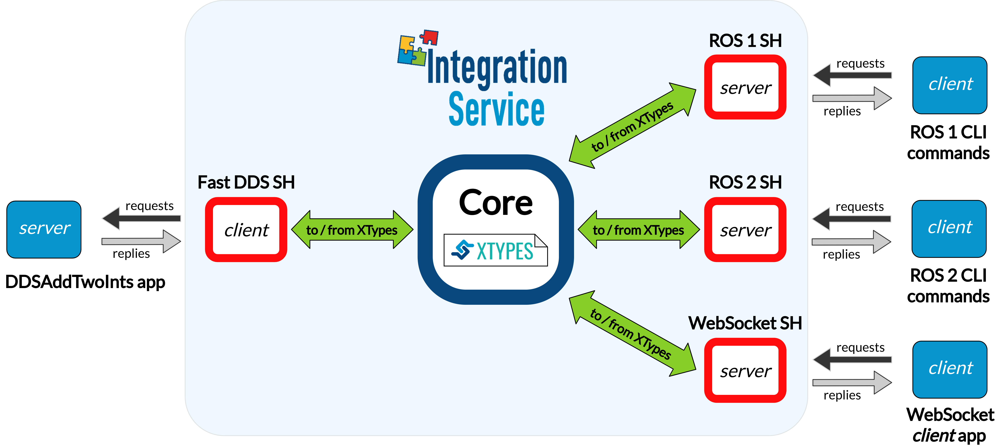

.. _dds_server_bridge:

DDS Service Server
==================

This example tackles the task of bridging a *DDS* server with one or more client applications,
implemented using a wide variety of protocols.

Specifically, we discuss how to forward petitions coming from *ROS 1*, *ROS 2* and a *WebSocket*
service client applications to a *Fast DDS* :code:`DDSAddTwoInts` server application,
so that it can process them and fulfill each request with a proper answer message.

.. note::

    If you are looking for an example on how to perform a service request from a *DDS* client
    to another protocol, please refer to any of the remaining examples in the
    :ref:`server/client examples <examples_different_protocols_services>` section.

.. _dds-server_requirements:

Requirements
^^^^^^^^^^^^

To prepare the deployment and setup the environment, you need to have *Integration Service*
correctly installed in your system.
To do so, please follow the steps delineated in the :ref:`installation` section.

Also, to get this example working, the following requirements must be met:

* Having **Fast DDS** (*v.2.0.0* or superior) installed and the *Integration Service*
  :code:`DDSAddTwoInts` example working.
  This example can be found in the main *Integration Service* repository, under the
  `examples/utils/dds/DDSAddTwoInts <https://github.com/eProsima/Integration-Service/tree/main/examples/utils/dds/DDSAddTwoInts>`_ folder;
  to compile it, you can either compile the whole *Integration Service* project using :code:`colcon` with the CMake flag
  :code:`BUILD_EXAMPLES` enabled; or execute the following steps:

  .. code-block:: bash

    cd ~/is-workspace/src/Integration-Service/examples/utils/dds/DDSAddTwoInts
    mkdir build && cd build
    cmake .. -DBUILD_EXAMPLES=ON && make

* Having the **Fast DDS System Handle** installed. You can download it from the
  `FastDDS-SH dedicated repository <https://github.com/eProsima/FastDDS-SH>`_
  into the :code:`is-workspace` where you have *Integration Service* installed:

  .. code-block:: bash

      cd ~/is-workspace
      git clone https://github.com/eProsima/FastDDS-SH.git src/FastDDS-SH

* Having **ROS 1** (*Melodic* or superior) installed and the *Integration Service*
  :code:`example_interfaces` *ROS 1* package compiled.
  This package can be found in the main *Integration Service* repository, under the
  `examples/utils/ros1/src/example_interfaces <https://github.com/eProsima/Integration-Service/tree/main/examples/utils/ros1/src/example_interfaces>`_ folder.
  To compile and install it:

  .. code-block:: bash

      source /opt/ros/$<ROS1_DISTRO>/setup.bash
      cd ~/is-workspace/src/Integration-Service/example/utils/ros1/catkin_ws
      catkin_make -DBUILD_EXAMPLES=ON -DCMAKE_INSTALL_PREFIX=/opt/ros/$<ROS1_DISTRO> install

* Having the **ROS 1 System Handle** installed. You can download it from the
  `ROS1-SH dedicated repository <https://github.com/eProsima/ROS1-SH>`_ into the
  :code:`is-workspace` where you have *Integration Service* installed:

  .. code-block:: bash

      cd ~/is-workspace
      git clone https://github.com/eProsima/ROS1-SH.git src/ROS1-SH

* Having **ROS 2** (*Foxy* or superior) installed, along with the :code:`example_interfaces` types package.
  To install it:

  .. code-block:: bash

      apt install ros-$<ROS2_DISTRO>-example-interfaces

* Having the **Static ROS 2 System Handle** installed. You can download it from the
  `ROS2-SH dedicated repository <https://github.com/eProsima/ROS2-SH>`_ into the :code:`is-workspace`
  where you have *Integration Service* installed:

  .. code-block:: bash

      cd ~/is-workspace
      git clone https://github.com/eProsima/ROS2-SH.git src/ROS2-SH src/ros2-sh

* Having `OpenSSL <https://www.openssl.org/>`_ and `WebSocket++ <https://github.com/zaphoyd/websocketpp>`_ installed:

  .. code-block:: bash

      apt install libssl-dev libwebsocketpp-dev

* Having the **WebSocket System Handle** installed. You can download it from the `WebSocket-SH dedicated repository <https://github.com/eProsima/WebSocket-SH>`_ into the :code:`is-workspace` where you have *Integration Service* installed:

  .. code-block:: bash

      cd ~/is-workspace
      git clone https://github.com/eProsima/WebSocket-SH.git src/WebSocket-SH

After you have everything correctly installed in your :code:`is-workspace`, build the packages by running:

.. code-block:: bash

    source /opt/ros/$<ROS2_DISTRO>/setup.bash
    colcon build --packages-skip-regex is-ros1 -DMIX_ROS_PACKAGES="example_interfaces"
    source /opt/ros/$<ROS1_DISTRO>/setup.bash
    colcon build --cmake-args -DBUILD_EXAMPLES=ON -DMIX_ROS_PACKAGES="example_interfaces"

Deployment
^^^^^^^^^^

Below we explain how to deploy a full example of this communication, calling the *DDS* service from
each of the available clients.

Launch the DDS AddTwoInts server
--------------------------------

To do so, open a terminal, go to the :code:`is-workspace` folder and execute the following command:

.. code-block:: bash

    cd ~/is-workspace
    ./build/is-examples/dds/DDSAddTwoInts/DDSAddTwoInts -m server

The server will start running under the default *DDS* domain ID 0 listening for incoming petitions.

Execute Integration Service
---------------------------

Open two terminals:

* In the first terminal, source the *ROS 1* installation and run the :code:`roscore`:

  .. code-block:: bash

      source /opt/ros/$<ROS1_DISTRO>/setup.bash
      roscore

* In the second terminal, go to the :code:`is-workspace` folder, source the *ROS 1*, *ROS 2* and local installations, and execute
  *Integration Service* with the :code:`integration-service` command followed by the
  `fastdds_server__addtwoints.yaml <https://github.com/eProsima/Integration-Service/blob/main/examples/basic/fastdds_server__addtwoints.yaml>`_
  configuration file located in the :code:`src/Integration-Service/examples/basic` folder.

  .. code-block:: bash

      source /opt/ros/$<ROS1_DISTRO>/setup.bash
      source /opt/ros/$<ROS2_DISTRO>/setup.bash
      source install/setup.bash
      integration-service src/Integration-Service/examples/basic/fastdds_server__addtwoints.yaml

Call the service from ROS 1
---------------------------

In a new terminal, source your *ROS 1* installation and invoke the service by executing the following
instructions:

.. code-block:: bash

    source /opt/ros/$<ROS1_DISTRO>/setup.bash
    rosservice call /add_two_ints 3 4

You should receive the following output from the *DDS* server processing the petition:

.. code-block:: bash

    sum: 7

Call the service from ROS 2
---------------------------

In a new terminal, source your *ROS 2* installation and invoke the service by executing the following
instruction:

.. code-block:: bash

    source /opt/ros/$<ROS2_DISTRO>/setup.bash
    ros2 service call /add_two_ints example_interfaces/srv/AddTwoInts "{a: 5, b: 17}"

You should receive the following output from the *DDS* server processing the petition:

.. code-block:: bash

    waiting for service to become available...
    requester: making request: example_interfaces.srv.AddTwoInts_Request(a=5, b=17)

    response:
    example_interfaces.srv.AddTwoInts_Response(sum=22)

Call the service from WebSocket
-------------------------------

The *WebSocket client* demo application used for this example can be found in the
`websocket.org/echo <https://www.websocket.org/echo.html>`_ webpage:

* First, under the **Location** section, connect to the *WebSocket server* automatically deployed by the *Integration Service*.
  To do so, and since the example is being run without SSL security,
  copy and paste the following URL into the *Location* field text box, and press **Connect**:

  .. code-block:: html

    ws://localhost:80

* Now it is time to advertise the service we want to use; to do so,
  under the *Message* text box, enter the following and press *Send*:

  .. code-block:: yaml

    {"op": "advertise_service", "service": "add_two_ints", "request_type": "AddTwoInts_Request", "reply_type": "AddTwoInts_Response"}

* Finally, after the service has been advertised, call it by sending the following message from the
  *WebSocket* echo:

  .. code-block:: yaml

    {"op": "call_service", "service": "add_two_ints", "args": {"a": 14, "b": 25}}

After this, in the *Log*, you should receive the following response from the *DDS* server:

.. code-block:: yaml

  RECEIVED: {"op":"service_response","result":true,"service":"add_two_ints","values":{"sum":39}}
