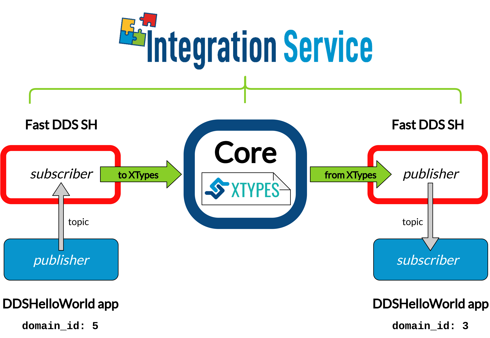

.. _dds_change_of_domain:

DDS Domain ID change
====================

A very typical scenario within the *DDS* ecosystem is that of two applications running under different *DDS* domain IDs,
so that they are isolated from each other; however, it might be required to bridge some of the topics
published by one of the applications, so that a subscriber on a different domain ID can consume this information.
This is where the *Integration Service* plays a fundamental role, by allowing to bridge two *DDS* dataspaces easily.

The steps described below allows a *Fast DDS HelloWorld* publisher  application,
running under a certain domain ID, to communicate with a *Fast DDS HelloWorld* subscriber application,
which is running under a different domain ID.

Requirements
^^^^^^^^^^^^

To prepare the deployment and setup the environment, you need to have *Integration Service* correctly
installed in your system.
To do so, please follow the steps delineated in the :ref:`installation` section.

Also, to get this example working, the following requirements must be met:

* Having **Fast DDS** (*v.2.0.0* or superior) installed and the *Integration Service*
  :code:`DDSHelloWorld` example working.
  This example can be found in the main *Integration Service* repository, under the
  `examples/utils/dds/DDSHelloWorld <https://github.com/eProsima/Integration-Service/tree/main/examples/utils/dds/DDSHelloWorld>`_ folder;
  to compile it, you can either compile the whole *Integration Service* project using :code:`colcon` with the CMake flag
  :code:`BUILD_EXAMPLES` enabled; or execute the following steps:

  .. code-block:: bash

    cd ~/is-workspace/src/Integration-Service/examples/utils/dds/DDSHelloWorld
    mkdir build && cd build
    cmake .. -DBUILD_EXAMPLES=ON && make

* Having the **Fast DDS System Handle** installed. You can download it from the `dedicated repository <https://github.com/eProsima/FastDDS-SH>`_
  into the :code:`is-workspace` where you have *Integration Service* installed:

  .. code-block:: bash

      cd ~/is-workspace
      git clone https://github.com/eProsima/FastDDS-SH.git src/FastDDS-SH

After you have everything correctly installed in your :code:`is-workspace`, build the packages by running:

.. code-block:: bash

    colcon build --packages-skip WebSocketAddTwoInts example_interfaces add_two_ints_server --cmake-args -DBUILD_EXAMPLES=ON

.. TODO: do the command above right once specific BUILD_<MW>_EXAMPLES flags are available

Deployment
^^^^^^^^^^

Below we explain how to deploy an example of this use case. To do so, open three terminals:

* In the first terminal, execute the :code:`DDSHelloWorld` example, as a subscriber running under
  *DDS* domain ID **3** and subscribed to the topic :code:`hello_domain_3`:

  .. code-block:: bash

      cd ~/is-workspace/build/DDSHelloWorld
      ./DDSHelloWorld -m subscriber -n hello_domain_3 -d 3

* In the second terminal, execute the :code:`DDSHelloWorld` example, as a publisher running under
  *DDS* domain ID **5** and publishing data to the topic :code:`hello_domain_3`:

  .. code-block:: bash

      cd ~/is-workspace/build/DDSHelloWorld
      ./DDSHelloWorld -m publisher -n hello_domain_3 -d 5

Up to this point, no communication should be seen between the publisher and the subscriber, due to the domain ID change.
This is where *Integration Service* comes into play to make the communication possible.

* In the third terminal, go to the :code:`is-workspace` folder, source the local installations,
  and execute *Integration Service* with the :code:`integration-service` command followed by the
  `fastdds__domain_id_change.yaml <https://github.com/eProsima/Integration-Service/blob/main/examples/basic/fastdds__domain_id_change.yaml>`_
  configuration file located in the :code:`src/Integration-Service/examples/basic` folder:

  .. code-block:: bash

      cd ~/is-workspace
      source install/setup.bash
      integration-service src/Integration-Service/examples/basic/fastdds__domain_id_change.yaml

Once the last command is executed, the two applications will start communicating.
