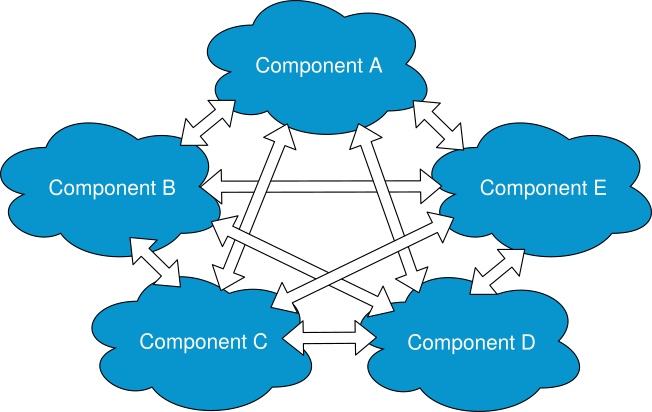
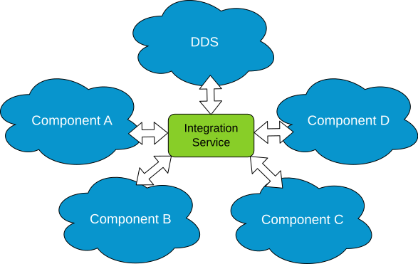

.. _integrate_large_system:

Integrate a large system
========================

Most systems evolve with time, undergoing the addition of new functionalities or new components.
When these new components are based on software or hardware that don't use a protocol compatible with the rest
of the system, an additional component must be created, usually known as *bridge*.

If the system contains several subsystems, and each component uses a different protocol, a *bridge* must be
created for each existing components pair that need to be communicated, making the integration of the new
component unhandy.

*eProsima Integration-Service* and its core ease this process.
Specifically, *eProsima Integration-Service* allows to integrate any *DDS* system into an already
existing system or viceversa, by providing an out-of-the-box bridge that straightforwardly puts into communication the
*DDS* and the non-*DDS* protocols.
Also, thanks, to its **System-Handle**-based structure, the core of *eProsima Integration-Service* allows to centralise
all the possible bridges between the rest of subsystems.

Once all protocols are communicated with *eProsima Integration-Service*, the inter-components
communication can be easily implemented by means of an individual YAML configuration file.

As explained in the :ref:`introductory section <main_features>`, *eProsima Integration-Service* already provides the
**System-Handle** for some common protocols.

This section is intended to illustrate an example of how *eProsima Integration-Service* integrates a *DDS*
application into a complex system comprising *Orion Context-Broker* and *ROS1*.

.. _orion:

Example: Integrate Orion Context-Broker and ROS1 into DDS
^^^^^^^^^^^^^^^^^^^^^^^^^^^^^^^^^^^^^^^^^^^^^^^^^^^^^^^^^

.. _fiware_ros1_requirements:

Requirements
------------

To prepare the deployment and setup the environment, you need to have *eProsima Integration-Service* correctly
installed in your system. To do so, please follow the steps delined in :ref:`Getting Started <getting_started>` and
read carefully the :ref:`Important remarks <important_remarks>` section.

To get this example working, the following requirements must be met:

- Having *ROS1* Melodic installed, with the *pub-echo* example working.
- Having the `HelloWorldExample <https://github.com/eProsima/SOSS-DDS/tree/doc/examples/examples/common/HelloWorldExample>`_
  compiled.
  To do so, go to the :code:`~/is-workspace/src/soss-dds/examples/common/HelloWorldExample` folder and type:

  .. code-block:: bash

      mkdir build
      cd build
      cmake ..
      make

- Having the `ros1_std_msgs <https://github.com/eProsima/SOSS-DDS/tree/doc/examples/examples/common/ros1_std_msgs>`_
  compiled.
  To do so, go to the :code:`~/is-workspace/src/soss-dds/examples/common/ros1_std_msgs` folder and type:

  .. code-block:: bash

      mkdir build
      cd build
      cmake ..
      make

- Having the **SOSS-ROS1 System-Handle** installed, that you can download from the dedicated
  `SOSS-ROS1 repository <https://github.com/eProsima/soss-ros1/tree/feature/xtypes-support>`__.
  Clone it into the workspace where you have *eProsima Integration-Service* installed:

  .. code-block:: bash

      cd ~/is-workspace
      git clone ssh://git@github.com/eProsima/soss-ros1 src/soss-ros1 -b feature/xtypes-support

  And then build the packages by running:

  .. code-block:: bash

      colcon build

- An accessible `Orion Context Broker <https://fiware-orion.readthedocs.io/en/master/>`__ service.
- `Asio <https://think-async.com/Asio/>`__ and `cURLpp <https://github.com/jpbarrette/curlpp>`__ installed.
- Having the **SOSS-FIWARE System-Handle** installed, that you can download from the dedicated
  `SOSS-FIWARE repository <https://github.com/eProsima/SOSS-FIWARE/tree/feature/xtypes-support>`__.
  Clone it into the workspace where you have *eProsima Integration-Service* installed:

  .. code-block:: bash

      cd ~/is-workspace
      git clone ssh://git@github.com/eProsima/SOSS-FIWARE src/soss-fiware -b feature/xtypes-support

  And then build the packages by running:

  .. code-block:: bash

      colcon build

Before proceeding, note that the
`dds_fiware_ros1.yaml <https://github.com/eProsima/SOSS-DDS/tree/doc/examples/examples/fiware/dds_fiware_ros1.yaml>`__
and the
`fiware_dds_ros1.yaml <https://github.com/eProsima/SOSS-DDS/tree/doc/examples/examples/fiware/fiware_dds_ros1.yaml>`__
configuration files located in the :code:`~/is-workspace/src/soss-dds/examples/fiware` folder must be edited to match
the IP
address and port used by the *contextBroker* configuration in the testing environment.

DDS publisher to Context Broker and ROS1 echo
---------------------------------------------

To publish from the *DDS* world to a system composed by a *contextBroker* service and a *ROS1* :code:`echo` application,
follow the steps detailed below.

Open four terminals (replace :code:`<url>` with the location of the *contextBroker*, following the format
:code:`<ip>:<port>`):

- In the first terminal, execute the Helloworld :code:`publisher`:

  .. code-block:: bash

      cd ~/is-workspace
      source install/setup.bash
      ./src/soss-dds/examples/common/HelloWorldExample/build/HelloWorldExample publisher

- In the second terminal, create/check the value of the :code:`data-binary` field in the *contextBroker*:

  #. When testing for the first time, the Helloworld entity must be created in the *contextBroker*:

     .. code-block:: bash

         curl --include \
             --request POST \
             --header "Content-Type: application/json" \
             --data-binary "{ \"type\": \"HelloWorld\", \"id\": \"HelloWorldTopic\", \"data\": { \"value\": \"\" } }" \
             '<url>/v2/entities'

  #. Check if the value of the attribute already exists by typing:

     .. code-block:: bash

         curl "http://<url>/v2/entities/HelloWorldTopic"

  #. Update the value:

     .. code-block:: bash

         curl --include \
             --request PUT \
             --header "Content-Type: application/json" \
             --data-binary "{ \"value\": \"<Updated message>\" }" \
             '<url>/v2/entities/HelloWorldTopic/attrs/data'

- In the third terminal, execute the *ROS1* :code:`echo` application with the command:

  .. code-block:: bash

      source /opt/ros/melodic/setup.bash
      rostopic echo /chatter

- In the fourth terminal, go to the :code:`is-workspace` folder where you have *eProsima Integration-Service* and the
  **SOSS-ROS1 System-Handle** and **SOSS-FIWARE System-Handle** installed, and execute the former using the
  :code:`soss` command followed by the :code:`dds_fiware_ros1.yaml`
  `YAML <https://github.com/eProsima/SOSS-DDS/blob/doc/examples/examples/fiware/dds_fiware_ros1.yaml>`__
  example file previously edited:

.. code-block:: bash

    cd ~/is-workspace
    source /opt/ros/melodic/setup.bash
    source install/setup.bash
    soss src/soss-dds/examples/fiware/dds_fiware_ros1.yaml

- Check again the value of the :code:`data` in the *contextBroker*:

.. code-block:: bash

    curl "http://<url>/v2/entities/HelloWorldTopic"

Now, the value must contain information (normally, :code:`HelloWorld`).

The *ROS1* :code:`echo` will show the updated values as well.

Context Broker to DDS subscriber and ROS1 echo
----------------------------------------------

If you want to test the communication the other way around, launch Helloworld as a :code:`subscriber` and force an
update in the *contextBroker* :code:`data` as detailed above (step 3 of the second terminal commands) while
*eProsima Integration-Service* is executing with the :code:`fiware_dds_ros1.yaml`
`YAML <https://github.com/eProsima/SOSS-DDS/blob/doc/examples/examples/fiware/fiware_dds_ros1.yaml>`__
example file previously edited.
Keep the *ROS1* application in :code:`listener` mode in order to avoid having two publishers at the same time.
Indeed, while possible, having *ROS1* publishing may hinder probing the example behavior correctly.
