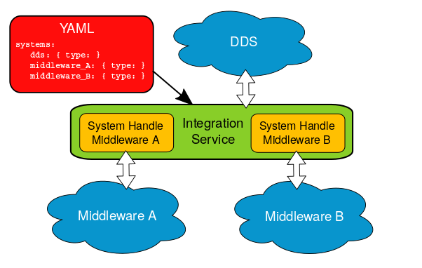

.. eProsima Integration-Services documentation master file.

.. _intro:

eProsima Integration Service
============================

.. image:: logo.png
    :height: 80px
    :width: 80px
    :align: left
    :alt: eProsima
    :target: http://www.eprosima.com/

*eProsima Integration Service* is a tool that enables intercommunicating an arbitrary number of protocols that
speak different languages.

If one has a number of complex systems and wills to combine them to create a larger, even more
complex system, *Integration Service* can act as an
intermediate message-passing tool that, by speaking a common language, centralizes and mediates the integration.

The communication between the different protocols is made possible by system-specific plugins, or
*System Handles*.
These provide the necessary conversion between the target protocols and the common representation
language spoken by *Integration Service*, based on an implementation of the
`XTypes <https://www.omg.org/spec/DDS-XTypes/About-DDS-XTypes/>`_.
Once a system is communicated with the core, it enters the *Integration Service* world and can
straightforwardly reach out to any other system that already exists in this world.

*Integration Service* is configured by means of a YAML text file, through which the user can provide a
mapping between the topics and services handled by the middlewares of the systems involved.

.. image:: images/general.png

This section provides an overview of this engine. It is organized as follows:

- :ref:`core`
- :ref:`shs`
- :ref:`yaml_files`
- :ref:`main_features`
- :ref:`structure_of_the_doc`

.. _core:

Integration Service Core
^^^^^^^^^^^^^^^^^^^^^^^^

*Integration Service* provides a plugin-based platform that is easily and intuitively configurable.
An *Integration Service* instance can connect *N* middlewares through dedicated plugins that speak the same
language as the core.
This common language is `eProsima xtypes <https://github.com/eProsima/xtypes>`_; a fast and lightweight
`OMG DDS-XTYPES standard <https://www.omg.org/spec/DDS-XTypes>`_ C++11 header-only implementation.
Find more information on the core and on the *XTypes* representation language in the :ref:`is-core` section
of this documentation.

.. TODO: add more info regarding the core?

.. _shs:

System Handles
--------------

The plugins, or *System Handles*, are discovered by *Integration Service* at runtime
after they have been installed.

Built-in *System Handles* are provided for the following systems: *DDS*, *Orion ContextBroker*, *ROS 1*, *ROS2*, and
*WebSocket*.
New *System Handles* for additional protocols can be easily created, automatically allowing communication of the
new protocol with the middlewares that are already supported.
Detailed information on how to create a *System Handle* can be found in the
:ref:`sh_creation` section of this documentation.

The plugin-based framework is especially advantageous when it comes to integrating a new component into a complex
system where the rest of sub-systems use incompatible protocols.
Indeed, once all protocols of interest are communicated with the core, each via a dedicated
*System Handle*, the integration happens straightforwardly.
The great advantage of using *Integration Service* is that it relies on centralization rather than on the creation
of dedicated bridges for each pair of components.
For a system made of *N* components, this means that the number of new software parts to add grows as *N*
rather than *N²*.

.. _yaml_files:

YAML configuration files
------------------------

*Integration Service* is configured by means of a YAML file that specifies a set of compulsory fields,
plus some optional ones.
The most common fields required to configure a **System-Handle** are:

* :code:`types`: specifies the IDL types used by *Integration Service* to transmit messages.

* :code:`systems`: specifies the middlewares involved in the communication.

  * :code:`types-from`: allows the middleware to inherit the type from another system.

* :code:`routes`: specifies which bridges *Integration Service* needs to create.

* :code:`topics`/:code:`services`: specify the topics exchanged over the above bridges in either publisher/subscriber
  or client/server type communications.

This configuration approach is especially profitable when it comes to integrating large systems, since a single YAML file
is needed no matter how many protocols are being communicated.

Below you can find a minimal example of the information that the YAML configuration file should contain.
In this example, a single topic is translated from *ROS 2* to *DDS*:

.. code-block:: yaml

    systems:
        ros2: { type: ros2 }
        dds: { types-from: ros2 }
    topics:
        chatter: { type: std_msgs/String, route: {from: ros2, to: dds} }

The strength of this approach is that different translations are possible by only changing the configuration file.

For example, by changing
the specified middlewares, one can obtain an instance which translates between *WebSocket + JSON*
(as produced and consumed by a standard web browser) and *DDS*:

.. code-block:: yaml

    types:
        idls:
            ->
                module std_msgs
                {
                    struct String
                    {
                        string data;
                    };
                };
    systems:
        web: { type: websocket_client, types-from: robot, host: localhost, port: 12345 }
        robot: { type: dds }
    routes:
        web2robot: {from: web, to: robot}
    topics:
        chatter: { type: "std_msgs/String", route: web2robot }

Detailed information on how to configure an *Integration Service*-mediated communication via a YAML file can be found in the
:ref:`yaml_config` section of this documentation.

.. _main_features:

Main features
-------------

**Free and Open Source.**

The *Integration Service* core, and all *System Handles* available to date are free and open source.
Consult the :ref:`related_links` section of the documentation to be redirected to the relevant
repositories.

**Easily configurable.**

As detailed above, an *Integration Service* instance is easily configurable by means of a YAML file.
For more information on how to do so, please consult the :ref:`yaml_config` section of this documentation.

**Easy to extend to new platforms.**

New platforms can easily enter the *Integration Service* world by generating the plugin, or *System Handle*
needed by the core to integrate them.
For more information on **System-Handles**, please consult the :ref:`sh_creation` section of this documentation.

**Easy to use.**

Installing and running *Integration Service* is intuitive and straightforward. Please refer to the
:ref:`Getting Started <getting_started>` section to be guided through the installation process.

**Commercial support.**

Available at support@eprosima.com

.. _structure_of_the_doc:

Structure of the Documentation
^^^^^^^^^^^^^^^^^^^^^^^^^^^^^^

This documentation is organized into the following sections.

Installation Manual
-------------------

This section provides the user with an easy-to-use installation guide and is organized as follows:

.. toctree::
    :caption: Installation Manual

    external_dep
    getting_started

User Manual
-----------

This section provides the user with an in-depth knowledge of *Integration Service*'s main aspects. First,
it provides an overview of the core structure.
Then, it details the internal structure of a *System Handle* which serves a guide for users to
create brand new *System Handles* for middlewares which are not integrated into the *Integration Service* ecosystem.
Following, it discusses how to configure *Integration Service* by means of YAML files, explaining how to fill the required fields,
depending on the needs of the specific use-case and middlewares involved in the communication.
Finally, it provides an overview of the *System Handles* existing to date.

.. toctree::
    :caption: User Manual

    is_core
    sh_creation
    yaml_config
    existing_shs

Use-cases and Examples
----------------------

In this section we discuss a collection of useful use-cases leveraging the already existing *System Handles*, with the aim of providing examples of usage and showcasing *Integration Service*'s functionalities.
For each use-case, a related example is presented and the user is guided step-by-step through the
installation protocol and environment preparation necessary to have the examples set up and working.
It is organized as follows:

.. toctree::
    :caption: Use-cases and Examples

    usecases_content
    dds-ros2
    dds_change_domain
    ros1-ros2
    ros2_change_domain
    ros2-websocket
    fiware-ros2
    wan

.. TODO: check if toc is up to date with latest changes.
