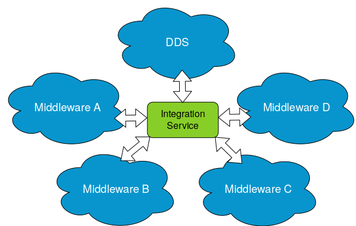

.. eProsima Integration-Services documentation master file.

eProsima Integration-Service
============================

.. image:: logo.png
    :height: 80px
    :width: 80px
    :align: left
    :alt: eProsima
    :target: http://www.eprosima.com/

*eProsima Integration-Service* is a tool based on `SOSS <https://github.com/eProsima/soss_v2>`__ and its
**System-Handle** `SOSS-DDS <https://github.com/eProsima/SOSS-DDS>`__ that allows intercommunicating any
*DDS*-based system with any other protocol, including other *DDS* systems, integrating them into a larger,
more complex system.

*eProsima Integration-Service* can be configured with a YAML text file, through which the user can provide a mapping
between the topics and services on the *DDS*-based middleware and those on the system(s) to which the user
wants to bridge it.

Main Features
^^^^^^^^^^^^^

*eProsima Integration-Service* provides an easily and intuitively configurable platform that allows connecting any
*DDS*-based system with any other protocol. This comes along with several appealing features.

.. image:: SH_2.png

System Handles
--------------

The core of the *eProsima Integration-Service* library defines a set of abstract interfaces and provides some utility
classes that form a plugin-based framework.
An *eProsima Integration-Service* instance can connect *N* middlewares where each middleware has a plugin,
or **System-Handle**, associated with it, that is discovered by *eProsima Integration-Service* at runtime after the
**System-Handle** has been installed.
Thanks to this, downstream users can extend *eProsima Integration-Service* to communicate any *DDS*-based system
with any middleware.

*eProsima Integration-Service* provides built-in **System-Handles** for connecting *Orion ContextBroker*,
*ROS*, *ROS2*, and *WebSocket* to the *DDS* world (and among them).

Adding a new **System-Handle** automatically allows communication with the rest of these protocols.

YAML configuration files
------------------------

*eProsima Integration-Service* is configured by means of a YAML file that specifies a set of compulsory fields,
plus some optional ones.
The most common fields required to configure a **System-Handle** are:

* :code:`types`: specifies the IDL types used by *eProsima Integration-Service* to transmit messages.
* :code:`systems`: specifies the middlewares involved in the communication.
  * :code:`types-from`: allows the middleware to inherit the type from another system.
* :code:`routes`: specifies which bridges SOSS needs to create.
* :code:`topics`/:code:`services`: specify the topics exchanged over the above bridges in either publisher/subscriber
  or client/server type communications.

Below you can find a minimal example of the information that the YAML configuration file should contain.
In this example, a single topic is translated from *ROS2* to *DDS*:

.. code-block:: yaml

    systems:
        ros2: { type: ros2 }
        dds: { types-from: ros2 }
    topics:
        chatter: { type: std_msgs/String, route: {from: ros2, to: dds} }

The versatility of *eProsima Integration-Service* is that it offers the possibilty to operate different translations
by only changing the configuration file.
For example, by changing
the specified middlewares, one can obtain an instance which translates between *WebSocket+JSON*
(as produced and consumed by a standard Web browser) and *DDS*:

.. code-block:: yaml

    types:
        idls:
            ->
                module std_msgs
                {
                    struct String
                    {
                        string data;
                    };
                };
    systems:
        web: { type: websocket_client, types-from: robot, host: localhost, port: 12345 }
        robot: { type: dds }
    routes:
        web2robot: {from: web, to: robot}
    topics:
        chatter: { type: "std_msgs/String", route: web2robot }

Additional features
-------------------

**Free and Open Source.**

The *eProsima Integration-Service* core, and all **System-Handles** available to date are free and open source.

**Easily configurable.**

As detailed above, an *eProsima Integration-Service* instance is easily configurable by means of a YAML file.
For more information on how to do so, please consult the link: YAML configuration
[TODO: link].

**Easy to extend to new platforms.**

New platforms can easily enter the *eProsima Integration-Service* world by generating the plugin, or **System-Handle**
needed by the core to integrate them.
For more information on **System-Handles**, please consult the link: System Handle Creation
[TODO: link].

**Easy to use.**

Installing and running *eProsima Integration-Service* is intuitive and straightforward. Please refer to the
:ref:`Getting Started <getting started>` section to be guided through the installation process.

**Commercial support.**

Available at support@eprosima.com

Structure of the Documentation
^^^^^^^^^^^^^^^^^^^^^^^^^^^^^^

This documentation is organized into the following sections.

Installation Manual
-------------------

This section is meant to provide the user with an easy-to-use installation guide and is organized as follows:

.. toctree::
    :caption: Installation Manual

    external_dep
    getting_started

User Manual
-----------

In this section we discuss the most representative use-cases demonstrating
*eProsima Integration-Service*'s functionalities.
For each use-case, a related example is presented and the user is guided step-by-step through the
installation protocol and environment preparation necessary to have the examples set up and working.
It is organized as follows:

.. _user_man:

.. toctree::
    :caption: User Manual

    usecases_content
    use-case1
    use-case2
    use-case3
    use-case4

