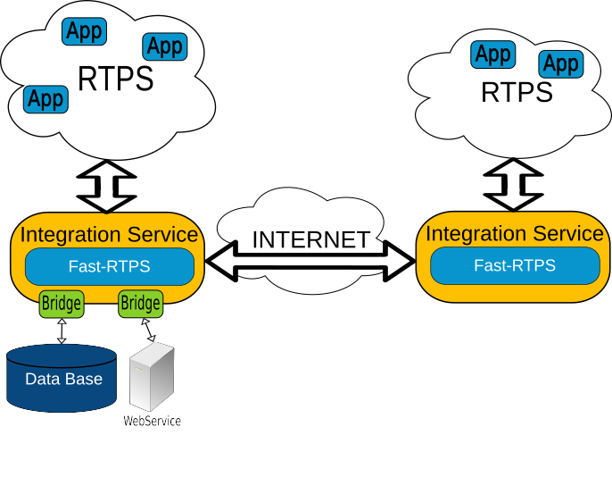

.. eProsima Integration Service documentation master file.

eProsima Integration Service Documentation
===========================================

.. image:: logo.png
    :height: 80px
    :width: 80px
    :align: left
    :alt: eProsima
    :target: http://www.eprosima.com/

*eProsima Integration Service* is a library based on *Fast RTPS* for allowing integration of distant and incompatible
systems. It allows to communicate RTPS applications across domains, and Local and Wide Area Networks, passing through
firewall and NAT.
*Integration Service* allows to apply custom data transformations and filtering between endpoints. With this feature
*Integration Service* can communicate legacy and incompatible systems between them and even with new developed systems,
without modifying a line of code.
*Integration Service* provides an easy-to-use API that allows to add support to any protocol.
*Integration Service* is able to create routing tables allowing to create filtering and complex communication
diagrams, like a writer communicating with several readers, and one of that readers receiving information
from another writer too.

The main features of *Integration Service* are:

- Integrating and expanding real-time systems across WANs without effort and without stopping or modifying existing applications.

- Allowing to build modular systems, including existing systems as submodules.

- Providing precise control over the flow of data, allows spliting networks and protect them with firewalls and NATs.

- Transforming data, changing topic names, quality of services, filtering, even data types and custom operations over the data values, allows to integrate different versions of topic definitions.

- Exposing selected topics and accepting data from remote locations it allows testing integration connectivity, topic compatibility and use-cases, easing development, integration and testing.

- Allowing remote connection to already working systems, for data analysis and verification.

- Easy-to-use API allowing to add support to non-RTPS systems.

This documentation is organized into the following sections:

* :ref:`relatedlinks`
* :ref:`user`
* :ref:`notes`

.. _relatedlinks:

.. toctree::
    :caption: Related Links

    getting_started

.. _user:

.. toctree::
    :caption: User Manual

    concepts_terms
    configuration
    technical

.. toctree::
    :caption: Use cases

    communicatedds
    transformdata
    dynamicdata
    tcptunnel
    newprotocol

.. _notes:

.. toctree::
    :caption: Release Notes

    notes
