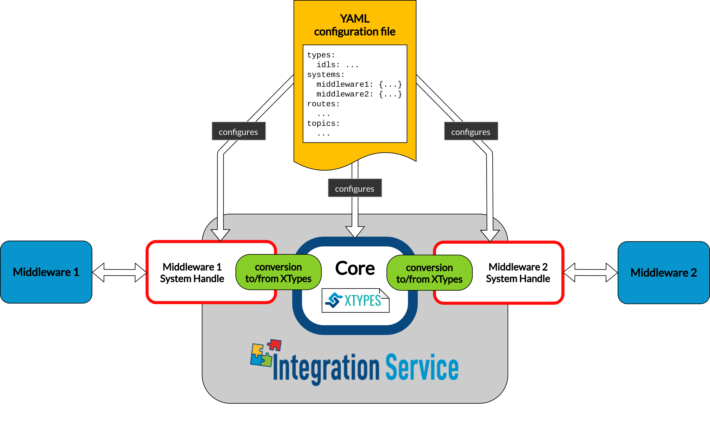

.. eProsima Integration-Services documentation master file.

.. _intro:

.. raw:: html

  <h1>
    eProsima Integration Service
  </h1>

.. image:: logo.png
    :height: 80px
    :width: 80px
    :align: left
    :alt: eProsima
    :target: http://www.eprosima.com/

*eProsima Integration Service* is a tool that enables intercommunicating an arbitrary number of protocols that
speak different languages.

If one has a number of complex systems and wills to combine them to create a larger, even more
complex system, *Integration Service* can act as an
intermediate message-passing tool that, by speaking a common language, centralizes and mediates the integration.

The communication between the different protocols is made possible by system-specific plugins, or
*System Handles*.
These provide the necessary conversion between the target protocols and the common representation
language spoken by *Integration Service*, based on an implementation of the
`xTypes <https://www.omg.org/spec/DDS-XTypes/About-DDS-XTypes/>`_.
Once a system is communicated with the core, it enters the *Integration Service* world and can
straightforwardly reach out to any other system that already exists in this world.

*Integration Service* is configured by means of a **YAML** text file, through which the user can provide a
mapping between the topics and services handled by the middlewares of the systems involved.

*Integration Service* comprises the following elements:

#. The :ref:`is_core` engine.
#. The :ref:`System Handles <sh>` or plugins, for each supported protocol.
#. A :ref:`yaml_config`, which follows a specific syntax.

Integration Service Core
^^^^^^^^^^^^^^^^^^^^^^^^

*Integration Service* provides a plugin-based platform that is easily and intuitively configurable.
An *Integration Service* instance can connect *N* middlewares through dedicated plugins that speak the same
language as the core.
This common language is `eProsima xTypes <https://github.com/eProsima/xtypes>`_; a fast and lightweight
`OMG DDS-XTYPES standard <https://www.omg.org/spec/DDS-XTypes>`_ C++17 header-only implementation.
Find more information on the core and on the *xTypes* representation language in the :ref:`is_core` user manual
of this documentation.

System Handles
^^^^^^^^^^^^^^

The plugins, or **System Handles**, are discovered by *Integration Service* at runtime
after they have been installed.

Available *System Handles* up-to-date are listed below:

.. list-table::
    :name: available_shs
    :header-rows: 1
    :align: left

    * - *System Handle*
      - Repository
    * - **Fast DDS System Handle**
      - https://github.com/eProsima/FastDDS-SH
    * - **FIWARE System Handle**
      - https://github.com/eProsima/FIWARE-SH
    * - **ROS 1 System Handle**
      - https://github.com/eProsima/ROS1-SH
    * - **ROS 2 System Handle**
      - https://github.com/eProsima/ROS2-SH
    * - **WebSocket System Handle**
      - https://github.com/eProsima/WebSocket-SH

New *System Handles* for additional protocols can be easily created, automatically allowing communication of the
new protocol with the middlewares that are already supported.
Detailed information on how to create a *System Handle* can be found in the
:ref:`sh` user manual of this documentation.

The plugin-based framework is specially advantageous when it comes to integrating a new component into a complex
system where the rest of sub-systems use incompatible protocols.
Indeed, once all protocols of interest are communicated with the core, each via a dedicated
*System Handle*, the integration happens straightforwardly.
The great advantage of using *Integration Service* is that it relies on centralization rather than on the creation
of dedicated bridges for each pair of components.
For a system made of *N* components, this means that the number of new software parts to add grows as *N*
rather than *N²*.

For further information, please refer to the :ref:`System Handle specific user manual <sh>` of the documentation.

YAML configuration files
^^^^^^^^^^^^^^^^^^^^^^^^

*Integration Service* is configured by means of a **YAML** file that specifies a set of compulsory fields,
plus some optional ones.

This configuration approach is especially profitable when it comes to integrating large systems,
since a single YAML file is needed no matter how many protocols are being communicated.

The strength of this approach is that different translations are possible by only changing the configuration file.
This means that no compilation steps are required between each *Integration Service* instantiation, as
it is configured at runtime.

Detailed information on how to configure an *Integration Service*-mediated communication via a YAML file
can be found in the :ref:`yaml_config` user manual of this documentation.

Main features
^^^^^^^^^^^^^

#. **Free and Open Source:** The `Integration Service Core <https://github.com/eProsima/Integration-Service>`_,
   and all :ref:`System Handles available to date <available_shs>` are free and open source.
#. **Easily configurable:** As detailed above, an *Integration Service* instance is easily configurable
   by means of a YAML file.
   For more information on how to do so, please consult the :ref:`yaml_config` user manual of this documentation.
#. **Easy to extend to new platforms:** New platforms can easily enter the *Integration Service*
   world by generating the plugin, or *System Handle* needed by the core to integrate them.
   For more information on **System-Handles**, please consult the :ref:`sh` user manual of this documentation.
#. **Easy to use:** Installing and running *Integration Service* is intuitive and straightforward. Please refer to the
   :ref:`Installation <installation>` manual to be guided through the installation process.

Typical use-cases
^^^^^^^^^^^^^^^^^

*Integration Service* comes in handy for a varied set of application scenarios, such as:

* **Communication among systems** using different protocols which handle incompatible types, topics, and services.
  A specific example that depicts this functionality would be the
  :ref:`ROS 1 to ROS 2 intercommunication example <ros1_ros2_bridge_pubsub>`.
* **Integration of systems under the same protocol** which are isolated per specific protocol features.
  The :ref:`DDS change of Domain ID <dds_change_of_domain>` example falls into this category.
* **Communication through the Internet** between systems hosted by logically separated WANs
  located in different geographical regions.
  A specific example using *Fast DDS* WAN capabilities can be found :ref:`here <wan_tcp_tunneling_dds>`.

Structure of the documentation
^^^^^^^^^^^^^^^^^^^^^^^^^^^^^^

This documentation is organized into the sections listed below:

*  :ref:`Installation Manual <installation_manual>`
*  :ref:`User Manual <user_manual>`
*  :ref:`Examples <examples>`

Contact and commercial support
^^^^^^^^^^^^^^^^^^^^^^^^^^^^^^

Find more about us at `eProsima's webpage <https://eprosima.com/>`_.

Support available at:

* Email: support@eprosima.com
* Phone: +34 91 804 34 48
