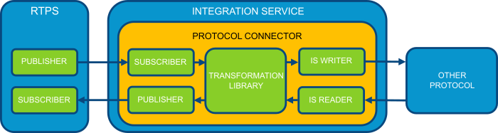
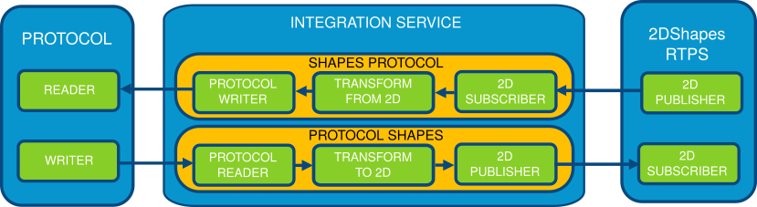

Adding new Bridges
==================

*Integration Service* allows the creation of custom *readers* and *writers* for any protocol.
This feature is the most powerful of *IS*, because it allows communicating any *DDS* application with any other
protocol, for example, *NGSIv2* from *FIWARE Orion ContextBroker*, which is a protocol based on WebServices.

To allow new protocols, *IS* provides an intuitive interface in its classes :ref:`ISWriter` and :ref:`ISReader` that
must be inherited by the new implementations, and a :ref:`Bridge Library` that will allow to load the new components
into *IS* through a :ref:`Connector <Connectors>`.

Bridge usage and configuration
------------------------------

An XML :ref:`configuration` file configures *Integration Service*.
In this case, is needed a :ref:`Bridge Library` to provide functions that will allow *IS* to create new instances
of :ref:`ISBridge`, :ref:`ISWriter`, and :ref:`ISReader`.
All these components must be declared (and optionally configured) in the :ref:`Bridge configuration`.

The library of the example will be named :class:`libprotocol.so`, so it's necessary to include its location path into the ``<bridge>``
section:

.. literalinclude:: config_new_bridge.xml
    :language: XML
    :start-after: <!-- bridge start -->
    :end-before: <!-- bridge end -->
    :dedent: 4

The library can accept configuration parameters through the ``<properties>`` tag.
In the next section, *readers* and *writers* must be declared to make them available for the *connectors*:

.. literalinclude:: config_new_bridge.xml
    :language: XML
    :start-after: <!-- reader start -->
    :end-before: <!-- reader end -->
    :dedent: 4

.. literalinclude:: config_new_bridge.xml
    :language: XML
    :start-after: <!-- writer start -->
    :end-before: <!-- writer end -->
    :dedent: 4

Both, again, can be configured using the ``<properties>`` tag.
And the :ref:`Connectors` are declared below:

.. literalinclude:: config_new_bridge.xml
    :language: XML
    :start-after: <!-- connectors start -->
    :end-before: <!-- connectors end -->
    :dedent: 4

In the previous example, there are defined a *DDS participant* :class:`2Dshapes` with a *publisher*
:class:`2d_publisher` and a *subscriber* :class:`2d_subscriber`. In the connectors, we bound :class:`2d_subscriber`
with :class:`protocol_publisher` and :class:`protocol_subscriber` with :class:`2d_publisher`.

Typically a *transformation function* will be useful to split responsibilities and allow *readers* and *writers*
to only worry about protocol details without data transformations.
The :ref:`Data Transformation` use case focuses on the usage of *Transformation Libraries*.

Integration Service's Bridges
-----------------------------

To allow *IS* instantiate custom :ref:`ISWriter` and :ref:`ISReader`, it's necessary to add a custom :ref:`Bridge Library`.
In this case, and typically, there is no need to override the default :ref:`ISBridge` behavior
(and normally isn't recommended).

As previously explained, the name of the library will be :class:`libprotocol.so`.
The next step in the creation process is to create a new source file named :class:`protocol.cpp` that
must implement the functions ``create_bridge``, ``create_writer``, and ``create_reader``.

Starting the implementation from scratch, it needs to include the required libraries, in this case, the
header file that gives access to the implementation of the :ref:`ISWriter` and the :ref:`ISReader`,
``ISBridgeProtocol.h``.

.. literalinclude:: new_bridge.cpp
    :language: cpp
    :start-after: // Include start
    :end-before: // Include end

.. _cmake_definitions_code_newprotocol:

The next part is optional, but it helps to make the library portable between different
operating systems and keeps the source code clear to read.

.. literalinclude:: new_bridge.cpp
    :language: cpp
    :start-after: // Define start
    :end-before: // Define end

This optional section should be taken in mind during the creation of the *CMakeLists.txt* file to configure the project.

Now, the library is in condition to start with the implementation of each function.

As established before the library doesn't need to override the default :ref:`ISBridge` behavior,
therefore, the ``create_bridge`` function will return ``nullptr``.

.. literalinclude:: new_bridge.cpp
    :language: cpp
    :start-after: // create_bridge start
    :end-before: // create_bridge end

The function ``create_reader`` will call directly to the *constructor* that will return the
configured instance of the :ref:`ISReader`.

.. literalinclude:: new_bridge.cpp
    :language: cpp
    :start-after: // create_reader start
    :end-before: // create_reader end

In the same way, the function ``create_writer`` will call directly to the *constructor* that will return the
configured instance of the :ref:`ISWriter`.

.. literalinclude:: new_bridge.cpp
    :language: cpp
    :start-after: // create_writer start
    :end-before: // create_writer end

The :ref:`Bridge API` section will detail these functions, along with the implementation of
:ref:`ISReader` and :ref:`ISWriter`.

Bridge API
----------

The same source code file can be used to implement the new :ref:`ISReader` and :ref:`ISWriter`, but it is preferable
to split the code into several files, and these implementations are very likely to be written in a separated file.
In the example, both implementations are written inside two header files ``ProtocolWriter.h`` and ``ProtocolReader.h``,
both included in ``ISBridgeProtocol.h``, but normally it will be split into source and header files instead
only use header files.

``ProtocolWriter.h`` will declare the class ``ProtocolWriter`` following the instructions of :ref:`ISWriter` section.

First, the typical definitions must be used to avoid including a header file multiple times:

.. literalinclude:: ProtocolWriter.h
    :language: cpp
    :start-after: // Define start
    :end-before: // Define end

And, in the last line of the file

.. literalinclude:: ProtocolWriter.h
    :language: cpp
    :start-after: // Endif start
    :end-before: // Endif end

Then, the file must include the required headers. The example will make use of the :class:`cURLpp` library.

.. literalinclude:: ProtocolWriter.h
    :language: cpp
    :start-after: // Include start
    :end-before: // Include end

The next step is to declare the class ``ProtocolWriter`` that must inherit from :ref:`ISWriter`.

.. literalinclude:: ProtocolWriter.h
    :language: cpp
    :start-after: // ProtocolWriter start
    :end-before: // ProtocolWriter end

Then the method's implementation must be defined.
The *constructor* will receive the configuration parameters and will parse them in the example.

.. literalinclude:: ProtocolWriter.h
    :language: cpp
    :start-after: // Constructor start
    :end-before: // Constructor end

The *destructor* will free any taken resource and memory allocation.

.. literalinclude:: ProtocolWriter.h
    :language: cpp
    :start-after: // Destructor start
    :end-before: // Destructor end

Finally, the example's ``write`` method implementation will update an entity using a WebService.

.. literalinclude:: ProtocolWriter.h
    :language: cpp
    :start-after: // Write start
    :end-before: // Write end

Now, ``ProtocolReader.h`` will declare the class ``ProtocolReader`` following the instructions of
the :ref:`ISWriter` section.

Again, the typical definitions must be used to avoid including a header file multiple times:

.. literalinclude:: ProtocolReader.h
    :language: cpp
    :start-after: // Define start
    :end-before: // Define end

And, in the last line of the file

.. literalinclude:: ProtocolReader.h
    :language: cpp
    :start-after: // Endif start
    :end-before: // Endif end

Then, the file must include the required headers. The example will make use of the :class:`cURLpp` library.

.. literalinclude:: ProtocolReader.h
    :language: cpp
    :start-after: // Include start
    :end-before: // Include end

The next step is to declare the class ``ProtocolReader`` that must inherit from :ref:`ISReader`.

.. literalinclude:: ProtocolReader.h
    :language: cpp
    :start-after: // ProtocolReader start
    :end-before: // ProtocolReader end

Then the method's implementation must be defined.
The *constructor* will receive the configuration parameters and will parse them in the example.

.. literalinclude:: ProtocolReader.h
    :language: cpp
    :start-after: // Constructor start
    :end-before: // Constructor end

The *destructor* will free any taken resource and memory allocation.

.. literalinclude:: ProtocolReader.h
    :language: cpp
    :start-after: // Destructor start
    :end-before: // Destructor end

Finally, the example's ``checkUpdates`` method implements a query to a WebService.

.. literalinclude:: ProtocolReader.h
    :language: cpp
    :start-after: // Read start
    :end-before: // Read end

Putting all together
--------------------

After that, the *bridge library* is implemented, but it still need to be built.
Any build system can be used for this task, but *IS* provides a *CMakeLists.txt* template that will be used as
starting point of an example.

First, the cmake project will be named to *protocol*.

.. literalinclude:: bridge_CMake.txt
    :language: cmake
    :lines: 1

It's recommendable to keep all *C++11* and *CMake* version as it is but to create the *CMakeLists.txt* from scratch,
it's important to keep in mind that *FastRTPSGen* generates files that depend on *Fast CDR* and *Fast RTPS*,
so they must be included as dependencies to the *CMakeLists.txt*.

In this case, the example will use *cURLpp* also.

.. literalinclude:: bridge_CMake.txt
    :language: cmake
    :start-after: # packages
    :lines: 1-3

To make the library more portable the cmake file needs to add the
:ref:`preprocessor definitions <cmake_definitions_code_newprotocol>` to build the library exporting symbols.

.. literalinclude:: bridge_CMake.txt
    :language: cmake
    :start-after: # definitions
    :lines: 1-4

Finally, *CMake* needs the source code of the library to build, along with its dependencies.

.. literalinclude:: bridge_CMake.txt
    :language: cmake
    :start-after: # protocol library
    :lines: 1-3

After that, the library will be generated using *CMake*.

.. code-block:: bash

    $ cmake .
    $ make

It should generate the *libprotocol.so* file in the current directory that is the library that
*IS* expects when loads the :class:`config.xml` file.

At this point, the configuration file :class:`config.xml` is created and the *bridge library* *libprotocol.so* built.
*IS* can be launch with the :class:`config.xml` and will allow receiving
and sending data to the new protocol thanks to the *bridge library*.

.. code-block:: bash

    $ integration_service config.xml

Creating new Bridges
--------------------

The steps needed to define *bridge libraries* to receive and send data to new protocols are:

- Create and configure the needed :ref:`Bridge configuration` in the XML configuration file.
- Create the needed :ref:`Connectors` in the XML configuration file.
- Implement the custom :ref:`Bridge Library`.
- Implement the custom :ref:`ISReader`, :ref:`ISWriter`, and, optionally but not recommended, :ref:`ISBridge`.
- Generate the library binary.
- Executing *IS* with the XML configuration file.

Bridge examples
---------------

FIROS2
^^^^^^

`FIROS2 <https://github.com/eProsima/FIROS2>`__ is the implementation of a :ref:`Bridge Library` that allows
the intercommunication between *ROS2* and *Fiware Orion ContextBroker*.

HelloWorld To File
^^^^^^^^^^^^^^^^^^

To illustrate this use case, there is an example named `Helloworld_to_file <https://github.com/eProsima/Integration-Service/blob/feature/TCP_DynTypes/examples/helloworld_to_file>`__.
This example creates a new *bridge* to save all received data from the *Fast-RTPS HelloWorldExample* into a file.

To achieve that target, it creates a *bridge library* named `isfile <https://github.com/eProsima/Integration-Service/blob/feature/TCP_DynTypes/examples/helloworld_to_file/isfile.cpp>`_.
The library only instantiates `FileWriter <https://github.com/eProsima/Integration-Service/blob/feature/TCP_DynTypes/examples/helloworld_to_file/FileWriter.cpp>`_ that implements the logic to save the data to a file.

The file `config.xml <https://github.com/eProsima/Integration-Service/blob/feature/TCP_DynTypes/examples/helloworld_to_file/config.xml>`__ of the example configures *IS* with the *bridge library* in a *connector* that receives data from *HelloWorldExample*.

**Preparation**

The `HelloWorldExample <https://github.com/eProsima/Fast-RTPS/tree/master/examples/C%2B%2B/HelloWorldExample>`_ from *Fast-RTPS* already must be compiled.

The `helloworld_to_file <https://github.com/eProsima/Integration-Service/tree/feature/TCP_DynTypes/examples/helloworld_to_file>`__
example must be compiled too.

Linux:

.. code-block:: bash

    $ mkdir build
    $ cd build
    $ cmake ..
    $ make

Windows:

.. code-block:: bash

    $ mkdir build
    $ cd build
    $ cmake -G "Visual Studio 14 2015 Win64" ..
    $ cmake --build .

The build process will generate the binary of the *bridge library*.

**Execution**

In one terminal, launch *HelloWorldExample* as a publisher:

.. code-block:: bash

    $ HelloWorldExample publisher

Launch *IS* in another terminal with the *config.xml* (*config_win.xml* if you are on Windows) file from the example folder:

Linux:

.. code-block:: bash

    $ cd <path_to_is_source>/examples/helloworld_to_file
    $ integration_service config.xml

Windows:

.. code-block:: bash

    $ cd <path_to_is_source>/examples/helloworld_to_file
    $ integration_service config_win.xml

Once *IS* is running, *HelloWorldExample* will match and a file named *output.txt* will be created with the
received data from *HelloWorldExample*.

.. image:: HW_TO_FILE.png
    :align: center