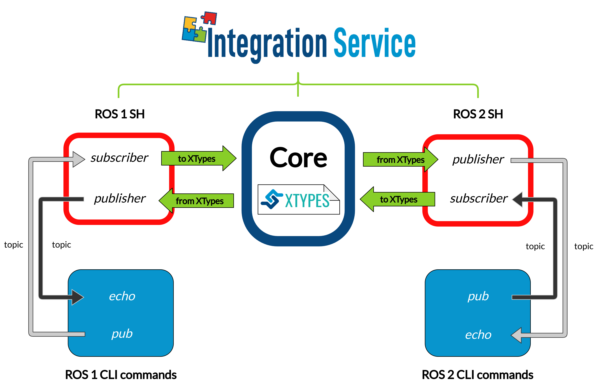

.. _ros1-ros2_bridge:

Example: ROS 1-ROS 2 bridge
===========================

Another typical situation of systems using different protocols is that of
*ROS 1* and *ROS 2*.

By using *Integration Service*, this communication can be achieved with minimum user's effort.
As both a **ROS 1 System Handle** and a *ROS 2 System Handle* already exist, the communication is straightforward.

In the example below, we show how *Integration Service* puts into communication two :code:`pub-echo` examples, one from
*ROS 2*, and the other from *ROS 1*.

.. _ros1-ros2_requirements:

Requirements
^^^^^^^^^^^^

To prepare the deployment and setup the environment, you need to have *Integration Service* correctly
installed in your system.
To do so, please follow the steps delineated in the :ref:`installation` section.

Also, to get this example working, the following requirements must be met:

* Having **ROS 2** (*Foxy* or superior) installed, with the :code:`talker-listener` example working.

* Having the **ROS 2 System Handle** installed. You can download it from the
  `ROS2-SH dedicated repository <https://github.com/eProsima/ROS2-SH>`_ into the
  :code:`is-workspace` where you have *Integration Service* installed:

  .. code-block:: bash

      cd ~/is-workspace
      git clone https://github.com/eProsima/ROS2-SH.git src/ROS2-SH

* Having **ROS 1** (*Melodic* or superior) installed, with the :code:`pub-echo` example working.

* Having the **ROS 1 System Handle** installed. You can download it from the
  `ROS1-SH dedicated repository <https://github.com/eProsima/ROS1-SH>`_ into the
  :code:`is-workspace` where you have *Integration Service* installed:

  .. code-block:: bash

      cd ~/dds-is-workspace
      git clone https://github.com/eProsima/ROS1-SH.git src/ROS1-SH

After you have everything correctly installed, build the packages by running:

.. code-block:: bash

    colcon build

Deployment
^^^^^^^^^^

Below we explain how to deploy an example of this communication in both directions allowed.

ROS 1 pub to ROS 2 echo
-----------------------

To enable communication from *ROS 1* to *ROS 2*, open four terminals:

* In the first terminal, source the *ROS 1* installation and run the :code:`roscore`:

  .. code-block:: bash

      source /opt/ros/$ROS1_DISTRO/setup.bash
      roscore

* In the second terminal, source the *ROS 1* installation and launch the *ROS 1* :code:`pub`:

  .. code-block:: bash

      source /opt/ros/$ROS1_DISTRO/setup.bash
      rostopic pub -r 1 /hello_ros2 std_msgs/String "Hello, ros2"

* In the third terminal, source the *ROS 2* installation and launch the *ROS 2* :code:`echo`:

  .. code-block:: bash

      source /opt/ros/$ROS2_DISTRO/setup.bash
      ros2 topic echo /hello_ros2 std_msgs/String

* In the fourth terminal, go to the :code:`is-workspace` folder, source the *ROS 2*, the
  *ROS 1*, and local installations, and execute *Integration Service* with the :code:`integration-service` command followed by the
  `ros1_ros2__helloworld.yaml <https://github.com/eProsima/Integration-Service/blob/main/examples/basic/ros1_ros2__helloworld.yaml>`_
  configuration file located in the :code:`src/Integration-Service/examples/basic` folder:

  .. code-block:: bash

      cd ~/is-workspace
      source /opt/ros/$ROS2_DISTRO/setup.bash
      source /opt/ros/$ROS1_DISTRO/setup.bash
      source install/setup.bash
      integration-service src/Integration-Service/examples/basic/ros1_ros2__helloworld.yaml

Once *Integration Service* is launched, the *ROS 1* :code:`pub` and the
*ROS 2* :code:`echo` will start communicating.

ROS 2 pub to ROS 1 echo
--------------------------

To enable communication from *ROS 2* to *ROS 1*, open four terminals:

* In the first terminal, source the *ROS 1* installation and run the :code:`roscore`:

  .. code-block:: bash

      source /opt/ros/$ROS1_DISTRO/setup.bash
      roscore

* In the second terminal, source the *ROS 2* installation and launch the *ROS 2* :code:`pub`:

  .. code-block:: bash

      source /opt/ros/$ROS2_DISTRO/setup.bash
      ros2 topic pub -r 1 /hello_ros1 std_msgs/String "{data: \"Hello, ros1\"}"

* In the third terminal, source the *ROS 1* installation and launch the *ROS 1* :code:`echo`:

  .. code-block:: bash

      source /opt/ros/$ROS1_DISTRO/setup.bash
      rostopic echo /hello_ros1

* In the fourth terminal, go to the :code:`is-workspace` folder, source the *ROS 2*, the
  *ROS 1*, and local installations, and execute *Integration Service* with the :code:`integration-service` command followed by the
  `ros1_ros2__helloworld.yaml <https://github.com/eProsima/Integration-Service/blob/main/examples/basic/ros1_ros2__helloworld.yaml>`_
  configuration file located in the :code:`src/Integration-Service/examples/basic` folder:

  .. code-block:: bash

      cd ~/is-workspace
      source /opt/ros/$ROS1_DISTRO/setup.bash
      source /opt/ros/$ROS2_DISTRO/setup.bash
      source install/setup.bash
      integration-service src/Integration-Service/examples/basic/ros1_ros2__helloworld.yaml

Once *Integration Service* is launched, the *ROS 2* :code:`pub` and the
*ROS 1* :code:`echo` will start communicating.
