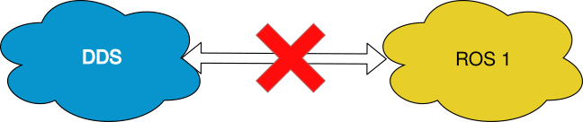
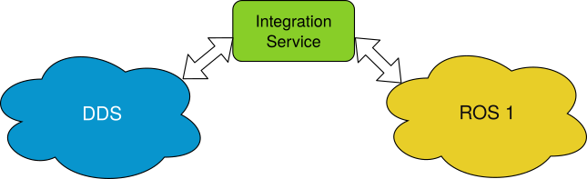

Add compatibility to an unsupported protocol
============================================

Another typical scenario encountered when communicating different systems is that they use different protocols,
for example, *DDS* and *ROS1*.

In such a case, in the absence of the *eProsima Integration-Service* tool
the user would need to create a custom *DDS* to *ROS1* bridge that won't be reusable to
communicate either of the two with other protocols.

By using *eProsima Integration-Service* instead, this communication can be achieved with minimum user's effort.
In this specific case, a *ROS1* **System-Handle** already exists, so the communication with *DDS* is
essentially direct.
However, the communication is straightforward enough even if a dedicated **System-Handle** doesn't exist yet, as
the user can create his own **System-Handle**, thus becoming able to communicate with *DDS* and
any other protocol already supported by *eProsima Integration-Service*.
For more information regarding how to generate a **System-Handle** from scratch, please consult the `System-Handle
Creation <https://soss.docs.eprosima.com/en/latest/sh_creation.html>`__ section of the *SOSS* documentation.

In the example below we show how *eProsima Integration-Service* bridges a *DDS* application
with a *ROS1* application, by communicating a HelloWorld *DDS* application with a *talker-listener* example.

Example: ROS1 communication
^^^^^^^^^^^^^^^^^^^^^^^^^^^

.. _ros1_requirements:

Requirements
------------

To prepare the deployment and setup the environment, you need to have *eProsima Integration-Service* correctly
installed in your system. To do so, please follow the steps delined in :ref:`Getting Started <getting started>` and
read carefully the :ref:`Important remarks <important remarks>` section.

To get this example working, the following equirements must be met:

- Having *ROS1* Melodic installed, with the *pub-echo* example working.
- Having the `HelloWorldExample <https://github.com/eProsima/SOSS-DDS/tree/doc/examples/examples/common/HelloWorldExample>`_
  compiled.
  To do so, go to the :code:`~/is-workspace/src/soss-dds/examples/common/HelloWorldExample` folder and type:

  .. code-block:: bash

      mkdir build
      cd build
      cmake ..
      make

- Having the `ros1_std_msgs <https://github.com/eProsima/SOSS-DDS/tree/doc/examples/examples/common/ros1_std_msgs>`_
  compiled.
  To do so, go to the :code:`~/is-workspace/src/soss-dds/examples/common/ros1_std_msgs` folder and type:

  .. code-block:: bash

      mkdir build
      cd build
      cmake ..
      make

- Having the **SOSS-ROS1 System-Handle** installed, that you can download from the dedicated
  `SOSS-ROS1 repository <https://github.com/eProsima/soss-ros1/tree/feature/xtypes-support>`__.
  Clone it into the workspace where you have *eProsima Integration-Service* installed:

  .. code-block:: bash

      cd ~/is-workspace
      git clone ssh://git@github.com/eProsima/soss-ros1 src/soss-ros1 -b feature/xtypes-support

  And then build the packages by running:

  .. code-block:: bash

      colcon build

ROS1 pub to DDS subscriber
--------------------------

Open three terminals:

- In the first terminal, launch the *ROS1* :code:`pub` application with the commands:

  .. code-block:: bash

      source /opt/ros/melodic/setup.bash
      rostopic pub -1 /chatter std_msgs/String -- "message"

  where "message" is some custom message chosen by the user.

- In the second terminal, execute the HelloWorld example as a :code:`subscriber`:

  .. code-block:: bash

      cd ~/is-workspace
      source install/setup.bash
      ./src/soss-dds/examples/common/HelloWorldExample/build/HelloWorldExample subscriber

- In the third terminal, go to the :code:`is-workspace` folder where you have *eProsima Integration-Service* and the
  **SOSS-ROS1 System-Handle** installed, and execute the former using the :code:`soss` command followed by the
  `ros1_dds.yaml <https://github.com/eProsima/SOSS-DDS/blob/doc/examples/examples/ros1/ros1_dds.yaml>`__
  configuration file located in the :code:`src/soss-dds/examples/ros1` folder:

  .. code-block:: bash

      cd ~/is-workspace
      source /opt/ros/melodic/setup.bash
      source install/setup.bash
      soss src/soss-dds/examples/ros1/ros1_dds.yaml

Once *eProsima Integration-Service* is launched, you should see that the *ROS1* :code:`pub` and the
HelloWorld :code:`subscriber` will start communicating.

DDS publisher to ROS1 echo
--------------------------

If you want to test it the other way around, launch the *ROS1* :code:`echo` with the command:

.. code-block:: bash

    source /opt/ros/melodic/setup.bash
    rostopic echo /chatter

Then launch the HelloWorld as a :code:`publisher`, and *eProsima Integration-Service* using the :code:`soss` command
followed by the `dds_ros1.yaml <https://github.com/eProsima/SOSS-DDS/blob/doc/examples/examples/ros1/dds_ros1.yaml>`__
configuration file located in the :code:`src/soss-dds/examples/ros1` folder instead:

.. code-block:: bash

    cd ~/is-workspace
    source /opt/ros/melodic/setup.bash
    source install/setup.bash
    soss src/soss-dds/examples/ros1/dds_ros1.yaml
