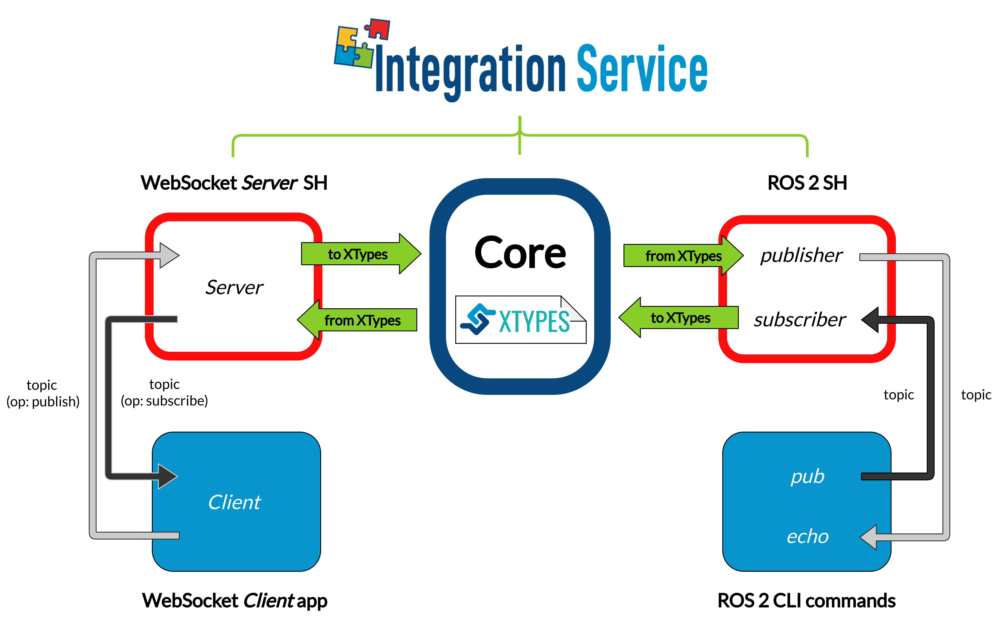

.. _ros2-websocket_comm:

Example: ROS 2 to WebSocket communication
=========================================

Another relevant use-case for *Integration Service* is that of connecting a *WebSocket* and a *ROS 2* application

The examples detailed below addresses the situation of a *ROS 2* :code:`talker-listener` example communicating with a *WebSocket* :code:`client`.

.. _ros2-websocket_requirements:

Requirements
^^^^^^^^^^^^

To prepare the deployment and setup the environment, you need to have *Integration Service* correctly
installed in your system.
To do so, please follow the steps delineated in the :ref:`core_installation` section.

Also, to get this example working, the following requirements must be met:

- Having *ROS 2* (Foxy or superior) installed, with the :code:`talker-listener` example working.

- Having the *ROS 2 System Handle* installed. You can download it from the `dedicated repository <https://github.com/eProsima/ROS2-SH>`_ into the :code:`is-workspace` where you have *Integration Service* installed:

  .. code-block:: bash
  
      cd ~/is-workspace
      git clone https://github.com/eProsima/ROS2-SH.git src/ROS2-SH

- `OpenSSL <https://www.openssl.org/>`_ and `WebSocket++ <https://github.com/zaphoyd/websocketpp>`_ installed.

- Having the *WebSocket System Handle* installed. You can download it from the `dedicated repository <https://github.com/eProsima/WebSocket-SH>`_ into the :code:`is-workspace` where you have *Integration Service* installed:

  .. code-block:: bash
  
      cd ~/is-workspace
      git clone https://github.com/eProsima/WebSocket-SH.git src/WebSocket-SH

After you have everything correctly installed in your :code:`is-workspace`, build the packages by running:

.. code-block:: bash

    colcon build

Deployment
^^^^^^^^^^

Below we explain how to deploy an example of this communication in both directions allowed.

ROS 2 pub to WebSocket client
--------------------------------------

To enable communication from *ROS2* to a *WebSocket client*, open two terminals:

- In the first terminal, source your *ROS 2* installation and execute a *ROS 2* :code:`pub`:

  .. code-block:: bash

      source /opt/ros/$ROS2_DISTRO/setup.bash
      ros2 topic pub /hello_websocket std_msgs/msg/String “{data: Hello WebSocket}”

- In the second terminal, go to the :code:`is-workspace` folder, source the *ROS 2* and local installations,
  and execute *Integration Service* with the :code:`integration-service` command followed by the
  `ros2_websocket__helloworld.yaml <https://github.com/eProsima/Integration-Service/blob/main/examples/basic/ros2_websocket__helloworld.yaml>`_
  configuration file located in the :code:`src/Integration-Service/basic` folder:

  .. code-block:: bash

      cd ~/is-workspace
      source /opt/ros/$ROS2_DISTRO/setup.bash
      source install/setup.bash
      integration-service src/Integration-Service/examples/basic/ros2_websocket__helloworld.yaml

Up to this point, the *Integration Service* should have created a *WebSocket server* application within the *WebSocket System Handle*, to listen and handle petitions coming from a *WebSocket client*. We will now explain how to simply test the intercommunication between *ROS 2* and a demo *WebSocket client* application, which can be found in `websocket.org/echo <https://www.websocket.org/echo.html>`_ webpage:

- First, under the **Location** section, connect to the *WebSocket server* automatically deployed by the *Integration Service*. To do so, and since the example is being run without SSL security, copy and paste the following URL into the *Location* field text box, and press **Connect**:

.. code-block:: html

    ws://localhost:80

- After this, you should see two WebSocket messages received automatically, due to the fact that the *WebSocket Server* hosted in the *Integration Service* detected an incoming connection: a *subscribe* operation message for the :code:`hello_ros2` topic; and an *advertise* operation for the :code:`hello_websocket` topic.

- Since the ROS 2 talker to WebSocket client example is being tested, we must first send a subscribe operation request for the :code:`hello_websocket` topic. To do so, under the *Message* text box, enter the following and press *Send*:

.. code-block:: html

    {"op": "subscribe", "topic": "hello_websocket", "type": "std_msgs/String"}

After this, in the *Log* you should receive the following message from *ROS 2*:

.. code-block: html

    RECEIVED: {"msg":{"data":"Hello WebSocket"},"op":"publish","topic":"hello_websocket"}

WebSocket client to ROS 2 echo
----------------------------------------

To enable communication from a *WebSocket client* to *ROS 2*, open two terminals:

- In the first terminal, source your *ROS 2* installation and execute a *ROS 2* :code:`echo`:

  .. code-block:: bash

      source /opt/ros/$ROS2_DISTRO/setup.bash
      ros2 topic echo /hello_ros2 std_msgs/msg/String

- In the second terminal, go to the :code:`is-workspace` folder, source the *ROS 2* and local installations,
  and execute *Integration Service* with the :code:`integration-service` command followed by the
  `ros2_websocket__helloworld.yaml <https://github.com/eProsima/Integration-Service/blob/main/examples/basic/ros2_websocket__helloworld.yaml>`_
  configuration file located in the :code:`src/Integration-Service/basic` folder:

  .. code-block:: bash

      cd ~/is-workspace
      source /opt/ros/$ROS2_DISTRO/setup.bash
      source install/setup.bash
      integration-service src/Integration-Service/examples/basic/ros2_websocket__helloworld.yaml

Up to this point, the *Integration Service* should have created a *WebSocket server* application within the *WebSocket System Handle*, to listen and handle petitions coming from a *WebSocket client*. We will now explain how to simply test the intercommunication between *ROS 2* and a demo *WebSocket client* application, which can be found in `websocket.org/echo <https://www.websocket.org/echo.html>`_ webpage:

- First, under the **Location** section, connect to the *WebSocket server* automatically deployed by the *Integration Service*. To do so, and since the example is being run without SSL security, copy and paste the following URL into the *Location* field text box, and press **Connect**:

.. code-block:: html

    ws://localhost:80

- After this, you should see two WebSocket messages received automatically, due to the fact that the *WebSocket Server* hosted in the *Integration Service* detected an incoming connection: a *subscribe* operation message for the :code:`hello_ros2` topic; and an *advertise* operation for the :code:`hello_websocket` topic.

- Since the WebSocket client to ROS 2 echo example is being tested, we must first send an advertise operation request for the :code:`hello_ros2` topic. To do so, under the *Message* text box, enter the following and press *Send*:

.. code-block:: html

    {"op": "advertise", "topic": "hello_ros2”, "type": "std_msgs/String"}

After this, we can send individual messages from the *WebSocket client*, using the *publish* operation:

.. code-block: html

    {"op": "publish", "topic": "hello_ros2", "msg": {"data": "Hello ROS 2"}}

The messages should be shown in the *ROS 2* echo terminal.
