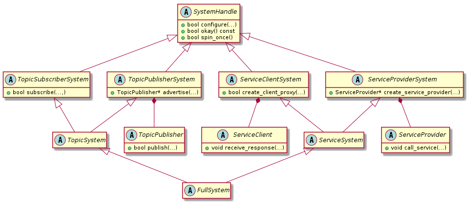
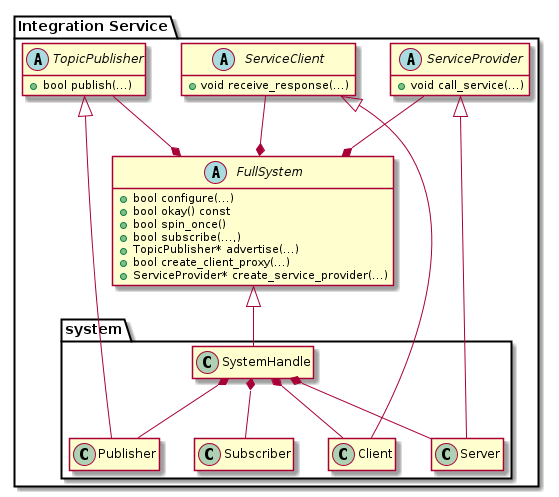
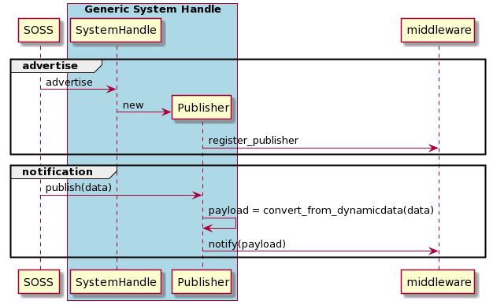
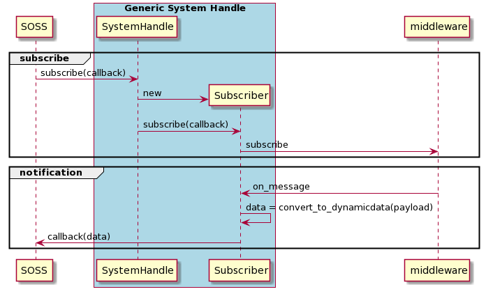
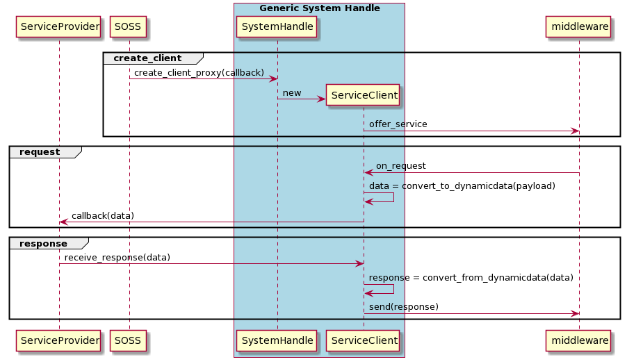
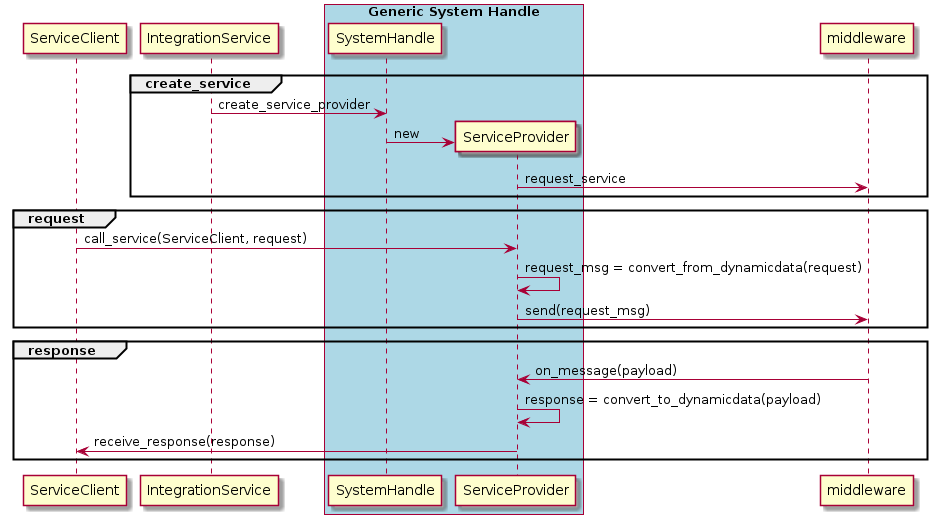

.. _sh_creation:

System Handle Creation
======================

As explained in the :ref:`introductory section <intro>`, a single :code:`integration-service`
executable can route any number of topics or services to/from any number of middlewares.

This happens via system-specific plugins that connect the core with the middlewares involved
in the communication.

*Integration Service* provides built-in *System Handles*
for connecting the core with *Fast DDS*, *FIWARE Orion Context Broker*, *ROS 1*, *ROS 2*, and *WebSocket*.

Additional *System Handles* can be implemented by users, in order to have the desired middlewares
joining the *Integration Service* world. Adding a new *System Handle* automatically allows communication with the
rest of the protocols already available in this ecosystem.

This section provides an overview of the architecture of a *System Handle*, by depicting the class inheritance structure and specifying the methods which need to be implemented in order to create a custom *System Handle*. All these concepts are eventually summarized by means of illustrative sequence diagrams. The section is organized as follows:

- :ref:`sh_hierarchy`
- :ref:`sh_implementation`
- :ref:`sequence_diagrams`

.. _sh_hierarchy:

System Handle hierarchy
^^^^^^^^^^^^^^^^^^^^^^^

.. TODO:

  * Rework this page to give more information that might be needed by the user.

Here you can find a diagram of a *System Handle* class inheritance structure.

Each *System Handle* must inherit, directly or indirectly, from the :code:`SystemHandle` superclass.
Depending on the nature of each protocol, it should implement the derived classes using multiple inheritance
from :code:`TopicSubscriberSystem`, :code:`TopicPublisherSystem`, :code:`ServiceClientSystem`,
and/or :code:`ServiceProviderSystem`.
To simplify this inheritance, classes :code:`TopicSystem`, :code:`ServiceSystem`, and :code:`FullSystem`
are available to inherit from.

.. _sh_implementation:

System Handle implementation
^^^^^^^^^^^^^^^^^^^^^^^^^^^^

In the diagram below, the architecture of a generic "Full" *System Handle* and its integration into *Integration Service*
is shown.

To ease the implementation, the new :code:`system::SystemHandle`
will inherit from :code:`FullSystem`. The following sections will explain
the methods to be implemented.

To implement the :code:`TopicPublisher`, :code:`ServiceClient`, and :code:`ServiceProvider` interfaces, the most direct
way is to create child classes, respectively :code:`system::Publisher`, :code:`system::Client`,
and :code:`system::Server`. An additional class :code:`system::Subscriber` may be useful to manage the subscribers
created. In the example shown in the diagram above, the :code:`system::SystemHandle`
will contain the needed instances of these classes, but any approach may be valid if the interfaces are met.

SystemHandle
~~~~~~~~~~~~

All *System Handles* must implement the :code:`configure`, :code:`okay`, and :code:`spin_once` methods that belong to
the superclass:

.. code-block:: cpp

    bool configure(
        const RequiredTypes& types,
        const YAML::Node& configuration,
        TypeRegistry& type_registry);

    bool okay() const = 0;

    bool spin_once();

The :code:`configure` method is called to setup the *System Handle* with the associated :code:`configuration`,
defined in the YAML file that is passed to it.
The types that the SH needs to manage to implement the communication are passed to this method via the :code:`types`
argument, whereas the new types created by the *System Handle* are expected to be filled in the :code:`type_registry`.

The :code:`okay` method is called by *Integration Service* to check if the *System Handle* is working. This method will
verify internally if the middleware has any problem.

The :code:`spin_once` method is called by *Integration Service* to allow spinning to those middlewares that need it.

TopicSubscriberSystem
~~~~~~~~~~~~~~~~~~~~~

This kind of system must implement the :code:`subscribe` method:

.. code-block:: cpp

    using SubscriptionCallback = std::function<void(const xtypes::DynamicData& message)>;

    bool subscribe(
        const std::string& topic_name,
        const xtypes::DynamicType& message_type,
        SubscriptionCallback callback,
        const YAML::Node& configuration);

*Integration Service* will call this method in order to create a new subscriber to the topic :code:`topic_name` using
:code:`message_type` type, plus an optional :code:`configuration`. Once the middleware system receives a message from
the subscription, the message must be translated into the :code:`message_type` and the *System Handle* must invoke
the :code:`callback` with the translated message.

TopicPublisherSystem
~~~~~~~~~~~~~~~~~~~~

This kind of system must implement the :code:`advertise` method:

.. code-block:: cpp

    std::shared_ptr<TopicPublisher> advertise(
        const std::string& topic_name,
        const xtypes::DynamicType& message_type,
        const YAML::Node& configuration);

*Integration Service* will call this method in order to create a new :code:`TopicPublisher` to the topic :code:`topic_name`
using :code:`message_type` type, and optional :code:`configuration`.

The :code:`TopicPublisher` is an interface that must be implemented by a :code:`Publisher` in order to allow
*Integration Service* to publish messages to the target middleware. This interface defines a single method :code:`publish`:

.. code-block:: cpp

    bool publish(const xtypes::DynamicData& message);

When *Integration Service* needs to publish to the middleware system it will call the :code:`TopicPublisher::publish` method,
with a message that must be translated from the :code:`message_type` parameter by the :code:`advertise` method above.

ServiceClientSystem
~~~~~~~~~~~~~~~~~~~

This kind of system must implement the :code:`create_client_proxy` method:

.. code-block:: cpp

    using RequestCallback =
        std::function<void(
            const xtypes::DynamicData& request,
            ServiceClient& client,
            std::shared_ptr<void> call_handle)>;

    bool create_client_proxy(
        const std::string& service_name,
        const xtypes::DynamicType& service_type,
        RequestCallback callback,
        const YAML::Node& configuration);

*Integration Service* will call this method in order to create a new :code:`ServiceClient` to the service :code:`service_name`
using the :code:`service_type` type, plus an optional :code:`configuration`. This :code:`ServiceClient` will be provided
as an argument in the :code:`callback` invocation when a response is received.

The :code:`ServiceClient` is an interface that must be implemented by a :code:`Client` in order to allow *Integration Service*
to relate a *request* with its *reply*. This is done by providing a :code:`call_handle` both in the
:code:`call_service` method from :code:`ServiceProvider` and in the :code:`callback` from :code:`create_client_proxy`
method.
When the *reply* is received by another *System Handle*, its :code:`ServiceProvider` will call the
:code:`receive_response` method from the :code:`Client`:

.. code-block:: cpp

    void receive_response(
        std::shared_ptr<void> call_handle,
        const xtypes::DynamicData& response);

The :code:`receive_response`:

- Translates the :code:`response` from :code:`service_type` and relate the :code:`call_handle`, if needed, to its
  middleware's request;
- Replies to its middleware.

ServiceProviderSystem
~~~~~~~~~~~~~~~~~~~~~

This kind of system must implement the :code:`create_service_proxy` method:

.. code-block:: cpp

    std::shared_ptr<ServiceProvider> create_service_proxy(
        const std::string& service_name,
        const xtypes::DynamicType& service_type,
        const YAML::Node& configuration);

*Integration Service* will call this method in order to create a new :code:`ServiceProvider` to the service :code:`service_name`
using the :code:`service_type` type, plus an optional :code:`configuration`.

The :code:`ServiceProvider` is and interface that must be implemented by a :code:`Server` in order to allow *Integration Service*
to *request* (or call) a service from the target middleware.

.. code-block:: cpp

    void call_service(
        const xtypes::DynamicData& request,
        ServiceClient& client,
        std::shared_ptr<void> call_handle);

This :code:`call_service` method will translate the :code:`request` from :code:`service_type` and will call its
middleware service, which stores the related :code:`call_handle` and :code:`client`. Once it receives the response
from its middleware, it must translate back the response and retrieve the :code:`call_handle` and :code:`client`
related. Then, it will invoke the :code:`receive_response` method from the client using the :code:`call_handle`
as argument.

.. _sequence_diagrams:

Sequence diagrams
^^^^^^^^^^^^^^^^^

The following diagrams illustrate the previous sections using a *generic* *System Handle*.

TopicPublisher flow
~~~~~~~~~~~~~~~~~~~

TopicSubscriber flow
~~~~~~~~~~~~~~~~~~~~

ServiceClient flow
~~~~~~~~~~~~~~~~~~

Note that a :code:`ServiceClient` acts as a client for *Integration Service* and as a server for the **middleware**.

ServiceProvider flow
~~~~~~~~~~~~~~~~~~~~

Note that a :code:`ServiceProvider` acts as a server for *Integration Service* and as a client for the **middleware**.

