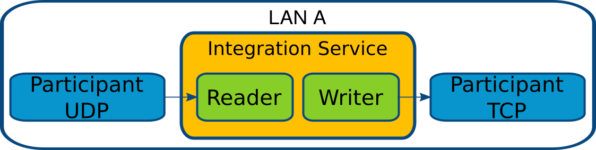
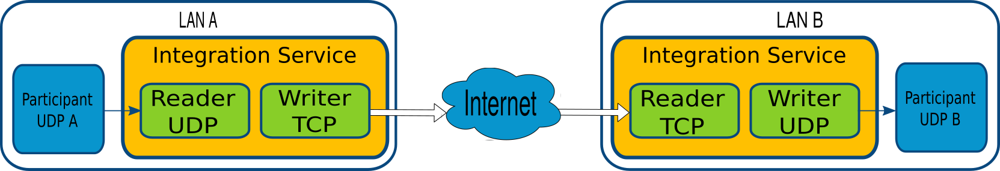
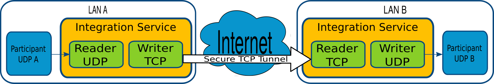
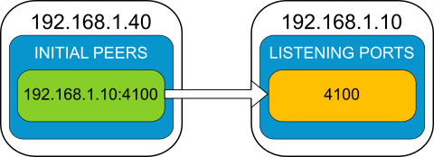
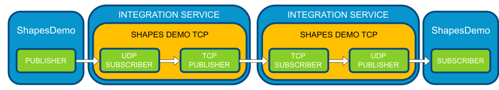

TCP Communication
=================

*Integration Service* can take advantage of *Fast RTPS TCP Transport* to communicate through TCP protocol.
With *TCP Transport IS* allows solving some communication scenarios where traditional *UDP Transport* will fail.
Here, there are some examples of these scenarios.

TCP Communication Scenarios
---------------------------

Single LAN
^^^^^^^^^^

Typical *DDS communication* uses *UDP* protocol, but in some cases, it's needed to connect through *TCP*.
*IS* allows communicating the transports, including one *participant UDP* with other *participant TCP*.

In this scenario, *IS* will communicate *Participant UDP* with *Participant TCP* thanks to a *Reader* configured
to use *UDP transport* and a *Writer* configured to use *TCP transport*.

Across NAT
^^^^^^^^^^

There are situations where may be useful to communicate two *DDS Participants* that belong to different LANs,
and this communication requires to create a connection over the Internet to get access from one LAN to the other.
As network devices block *UDP* communication usually, *IS* must use a *TCP tunnel* to achieve the communication within
NAT, WLAN, etc.

In this configuration, *IS* will connect *Writer TCP* from *LAN A* with *Reader TCP* from *LAN B* using *TCP transport*
over the Internet.

Secure Communication
^^^^^^^^^^^^^^^^^^^^

To establish a secured communication, *IS* can use *DDS Security* attributes and all *TCP transport*
security options in *Fast RTPS profiles* to be able to establish a secure *TCP tunnel*.

This scenario is equivalent to :ref:`Across NAT` but includes *Fast RTPS security* attributes to get a secure
*TCP Tunnel*.

TCP Tunnel with Integration Service
-----------------------------------

All these scenarios share the usage and configuration of a *TCP transport* to make them possible.
You can get the complete documentation about how to configure different transports at
`Fast RTPS advanced configuration <http://docs.eprosima.com/en/latest/pubsub.html#advanced-configuration>`__.

Here, we are going to focus on *IS* related configuration.

Initial Peers and Listening Ports
^^^^^^^^^^^^^^^^^^^^^^^^^^^^^^^^^

An *initial peer* is a *Locator* that points to where an *endpoint* is listening. In *TCP transports*,
*initial peers* are mandatory to allow connections with the remote *endpoint*.
Only one *endpoint* needs to configure its *initial peers*, but both may have them.

In *TCP Transport*, there are two new roles related with which *endpoint* starts the *TCP* communication.
The *endpoint* which connects with its *initial peers* is known as *connector* (or *client*),
while the *endpoint* which receives the incoming connections is known as *acceptor* (or *server*).
Any *acceptor* must define at least one *listening port*, that will be the physical *TCP* port where the application
will bound for incoming connections.
An *endpoint* can define *initial peers* and *listening ports*, and will act as *acceptor* with nodes that connect
to its *listening ports*, and will act as *connector* with nodes that are connected by it using its *initial peers*.

The *listening ports* are configured in the ``<transport_descriptor>`` section of
`Fast RTPS XML Profiles <http://docs.eprosima.com/en/latest/xmlprofiles.html>`__.

.. literalinclude:: tcptunnel.xml
    :language: xml
    :start-after: <!-- Transport Descriptors Start -->
    :end-before: <!-- Transport Descriptors End -->
    :dedent: 4

The *initial peers* are configured inside the ``<builtin>`` tag of each *participant*.

.. literalinclude:: tcptunnel.xml
    :language: xml
    :start-after: <!-- Initial Peers Start -->
    :end-before: <!-- Initial Peers End -->
    :dedent: 4

Please, read
`Fast RTPS advanced configuration <http://docs.eprosima.com/en/latest/pubsub.html#advanced-configuration>`__
for complete information about *TCP transport* configuration.

TCP Transport Descriptor
^^^^^^^^^^^^^^^^^^^^^^^^

*TCP Transport Descriptor* is used by *Fast RTPS* to configure the *TCP* parameters of the *transport* instance.
A complete description of *transport descriptors* can be found in
`Fast RTPS Transport descriptor section <http://docs.eprosima.com/en/latest/xmlprofiles.html#transport-descriptors>`__.

Fast-RTPS Security
^^^^^^^^^^^^^^^^^^

To get more information about *Fast-RTPS Security*, please read
`Fast RTPS Security documentation <http://docs.eprosima.com/en/latest/security.html>`__.

TCP Tunnel Example
------------------

To illustrate the use cases, there is an example named
`ShapesDemoTCP <https://github.com/eProsima/Integration-Service/blob/master/examples/shapes_demo_tcp>`__.
In this example, *IS* creates and uses a *TCP tunnel* to communicate two *Fast-RTPS ShapesDemo* in different ways.
*IS* should be already :ref:`installed <installation manual>` to execute the example.

Several configuration files are included:

- `config_client.xml <https://github.com/eProsima/Integration-Service/blob/master/examples/shapes_demo_tcp/config_client.xml>`__: Configures *IS* as a *TCP client* and acts as a shapes *publisher*.

- `config_server.xml <https://github.com/eProsima/Integration-Service/blob/master/examples/shapes_demo_tcp/config_server.xml>`__: Configures *IS* as a *TCP server* and acts as a shapes *subscriber*.

- `config.xml <https://github.com/eProsima/Integration-Service/blob/master/examples/shapes_demo_tcp/config.xml>`__: Configures two IS connectors, one as a config_client and the other as a config_server.

*config.xml* is intended to execute this test using one machine, and *client* plus *server* versions,
to allow executions on different machines.

This example will use *config.xml* to test it in one machine.

The example uses a types library named `shapelib <https://github.com/eProsima/Integration-Service/blob/master/examples/shapes_demo_tcp/shapelib.cpp>`__ that allows us to create the keyed type :class:`shape`, and ShapesDemo uses it to communicate.

To allow executing the example in the same machine, each ShapesDemo instance will be bound to different domains,
allowing *IS* to do some useful work.

**Preparation**

This example needs a `ShapesDemo <https://github.com/eProsima/ShapesDemo>`__ application working, to get it, you must compile the example itself, from the `shapes_demo_tcp example location <https://github.com/eProsima/Integration-Service/tree/master/examples/shapes_demo_tcp>`_.

Linux:

.. code-block:: bash

    $ mkdir build
    $ cd build
    $ cmake ..
    $ make

Windows:

.. code-block:: bash

    $ mkdir build
    $ cd build
    $ cmake -G "Visual Studio 14 2015 Win64" ..
    $ cmake --build .

The build process will generate the binary of the types library.

**Execution**

In two different terminals, launch two ShapesDemos:

.. code-block:: bash

    $ ShapesDemo

In one of the ShapesDemo, change the domain in its configuration window to **1**. Then publish some shape.

In the other ShapesDemo, subscribe to that kind of shape.

The *subscriber* ShapesDemo shouldn't receive any data as they belong to different domains.

Launch *IS* in another terminal with the *config.xml* (*config_win.xml* if you are on Windows) file from the example folder:

Linux:

.. code-block:: bash

    $ cd <path_to_is_source>/examples/shapes_demo_tcp
    $ integration_service config.xml

Windows:

.. code-block:: bash

    $ cd <path_to_is_source>/examples/shapes_demo_tcp
    $ integration_service config_win.xml

Once *IS* is running, both ShapesDemo must start to communicate, and the *subscriber* ShapesDemo should begin to receive
data from the *publisher*

