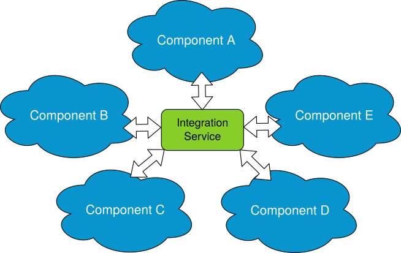

Integrate a large system
========================

Most systems evolve with time, undergoing the addition of new functionalities or new components.
When these new components are based on software or hardware that don't use a protocol compatible with the rest
of the system, an additional component must be created, usually known as *bridge*.

If the system contains several subsystems, and each component uses a different protocol, a *bridge* must be
created for each existing components pair that need to be communicated, making the integration of the new
component quite unhandy.

.. image:: LARGER_SYSTEM_BAD.png

:code:`Integration-service` eases this process, allowing to integrate any :code:`DDS` system into an already
existing system or viceversa, by providing an out-of-the-box bridge that straightforwardly allows to communicate the 
:code:`DDS` and the non-:code:`DDS` protocols.

Also, the core of :code:`integration-service` allows to centralise all the possible bridges among
the subsystems by means of system-specific plugins, or **System-Handles**, that speak the same language as the core.

Once all the protocols of interest are communicated with :code:`integration-service`,
each via a dedicated **System-Handle**, the inter-components communication
can be easily implemented by means of a YAML configuration file, rather than by creating a dedicated 
bridge for each pair of communicating components.
For a system made of *N* components, this means that the number of new software parts to add grows as *N*
rather than *N²*.

Notice that :code:`integration-service` already provides the **System-Handle** for some of the most common
protocols.

This section is intented to illustrate an example of how :code:`integration-service` integrates a :code:`DDS`
application into a :code:`Orion Context-Broker` system.

Example: Orion Context-Broker
^^^^^^^^^^^^^^^^^^^^^^^^^^^^^

To prepare the deployment and setup the environment correctly, please follow the introductory steps delined in
:ref:`Getting Started <getting started>` and read carefully the :ref:`Important reminders <important reminders>`
section.

Also, to make this example work, you will require:

- An accesible :code:`contextBroker` service.
- An installation of the :code:`SOSS-FIWARE` **System-Handle**, that you can download from the dedicated
  `SOSS-FIWARE repository <https://github.com/eProsima/SOSS-FIWARE/tree/feature/xtypes-support>`__).
- An installation of :code:`Fast-RTPS` (at least v1.9.2) with the *HelloWorld* example working. Indeed, in order to feed
  the :code:`contextBroker`, the example will use a :code:`Fast-RTPS` HelloWorld *publisher*.

The file :code:`soss-dds/examples/udp/dds_fiware.yaml` must be edited to match the IP address and port used by the
:code:`contextBroker` configuration in the testing environment.

**Note**: If you built the :code:`integration-service` and/or :code:`SOSS-FIWARE` packages with colcon, please make sure
to have done all the required sourcing of the colcon overlays or, in alternative, to have added the opportune
source commands to the .bashrc file, as explained in the :ref:`Getting Started <getting started>` section.

Open three terminals (replace <url> with the location of the :code:`contextBroker`, 
following the format :code:`http://<ip>:<port>`):

- In the first terminal, execute the HelloWorld *publisher*:

.. code-block:: bash

    ./HelloWorldExample publisher

- In the second terminal, create/check the value of the :code:`data` field in the :code:`contextBroker`:

  - When testing for the first time, the structure for this test must be created in the :code:`contextBroker`:

  .. code-block:: bash

      curl --include \
          --request POST \
          --header "Content-Type: application/json" \
          --data-binary "{ \"type\": \"String\", \"id\": \"String\", \"data\": { \"value\": \"\" } }" \
          '<url>/v2/entities?options='

  - Check the value of the attribute if it already exists:

  .. code-block:: bash

      curl <url>/v2/entities/String/attrs/data/value?type=String

  - If the result isn't empty, set the value to empty:

  .. code-block:: bash

      curl <url>/v2/entities/String/attrs/data/value -X PUT -s -S --header 'Content-Type: text/plain' --data-binary \"\"

- Execute :code:`integration-service` in the third terminal with the YAML example file:

.. code-block:: bash

    soss soss-dds/examples/udp/dds_fiware.yaml

- Check again the value of the data in the `contextBroker`:

.. code-block:: bash

    curl <url>/v2/entities/String/attrs/data/value?type=String

Now, the value must contain information (normally, "HelloWorld").

If you want to test the communication the other way around, launch Helloworld as *subscriber* and force an update
in the :code:`contextBroker` data while :code:`integration-service` is executing with the same YAML file.

.. _comment_3: Maybe some changes must be done to allow the conversion between the struct types.