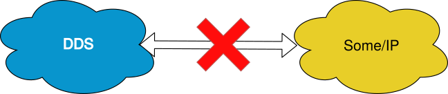
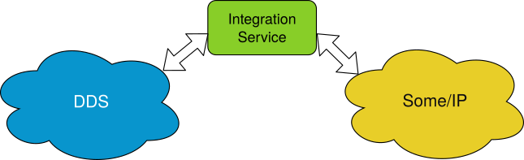

Add compatibility to an unsupported protocol
============================================

Another typical scenario encountered when communicating different systems is that they use different protocols,
for example, :code:`DDS` and :code:`SOME/IP`.

In such a case, in the absence of the :code:`integration service` tool
the user would need to create a custom :code:`DDS` to :code:`SOME/IP` bridge that will not be reusable to
communicate neither of the two with other protocols.

By using :code:`integration-service` instead, this communication can be achieved with minimum user's effort.
In this specific case, a :code:`SOME/IP` **System-Handle** already exists, so the communication with :code:`DDS` is 
essentially direct.
However, the communication is straightforward enough even if a dedicated **System-Handle** doesn't exist yet, as
the user can create his own **System-Handle**, thus becoming able to communicate with :code:`DDS` and
any other protocol already supported by :code:`integration-service`.
For more information regarding how to generate a **System-Handle** from scratch, please consult the *System-Handle
creation* [TODO: add link] section of the :code:`soss` documentation.

In the example below we show how :code:`integration-service` bridges a :code:`DDS` application with a
with :code:`SOME/IP` application, by communicating a *radar/fusion* :code:`DDS` application with :code:`SOME/IP`.

Example: SOME/IP
^^^^^^^^^^^^^^^^

To prepare the system and setup the environment correctly, please follow the introductory steps delined in
:ref:`Getting Started <getting started>` and read carefully the :ref:`Important reminders <important reminders>`
section.

Also, to execute this example you need to have installed:

- :code:`vsomeip`.
- The :code:`SOSS-SOME/IP` **System-Handle**, that you can download from the dedicated SOSS-SOMEIP repository
  [TODO: add link, when public].
  Specifically, you will need the :code:`simple_radar_fusion_fastdds` and :code:`simple_radar_fusion_vsomeip` examples
  compiled. These examples are located in the :code:`examples/radar_fusion_dds` folder.

**Note**: If you built the :code:`integration-service` and/or :code:`SOSS-SOME/IP` packages with colcon, please make
sure to have done all the required sourcing of the colcon overlays or, in alternative, to have added the opportune
source commands to the .bashrc file, as explained in the :ref:`Getting Started <getting started>` section.

Open three terminals:

- In the first terminal, launch the :code:`radar` application:

.. code-block:: bash

    radar

- In the second terminal, execute the :code:`RadarExample` as *subscriber*:

.. code-block:: bash

    RadarExample subscriber

- In the third terminal, execute :code:`integration-service` with the :code:`someip_dds.yaml` configuration file:

.. code-block:: bash

    soss examples/radar_fusion_dds/someip_dds.yaml

Once :code:`soss` is launched, you should see that the :code:`radar` and the :code:`RadarExample` *subscriber*
will start communicating.

If you want to test it the other way around, launch :code:`fusion`, :code:`RadarExample` as *publisher*,
and :code:`integration-service` with the file :code:`dds_someip.yaml` instead.

Take into account that due to limitations in the :code:`SOME/IP` protocol,
:code:`integration-service` doesn't work when executed with :code:`radar` and 
with the file :code:`dds_someip.yaml`, because both try to offer the same service.