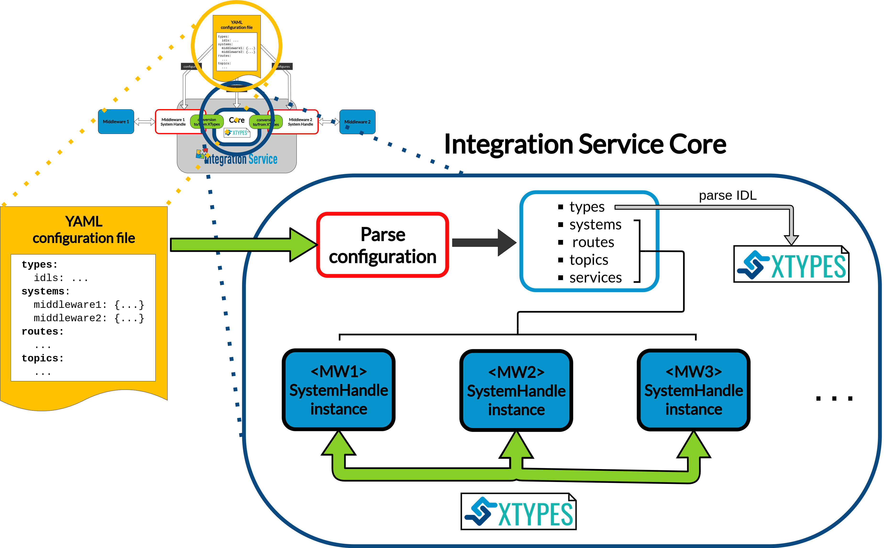

.. role:: raw-html(raw)
    :format: html

.. _is_core:

Integration Service Core
========================

The :code:`is-core` library defines a set of abstract interfaces and provides some utility classes
that form a plugin-based framework.

A single :code:`integration-service` executable instance can connect `N` middlewares,
where each middleware has a plugin, or *System Handle* associated with it.

The *System Handle* for a middleware is a lightweight wrapper around that middleware (e.g. a *ROS* node or a *WebSocket*
server/client). The :code:`is-core` library provides CMake functions that allow these middleware
*System Handles* to be discovered by the :code:`integration-service` executable at runtime after the *System Handle*
has been installed.

A single :code:`integration-service` instance can route any number of topics or services to/from any number of
middlewares.
Because of this, downstream users can extend *Integration Service* to communicate with any middleware.

According the diagram depicted above, the *Integration Service Core* executes the following steps:

#. **Parse** the *YAML* configuration file. This file must contain everything needed to successfully
   launch an *Integration Service* instance.
   To get a detailed view on how to write a configuration file for the *Integration Service*, please
   refer to the :ref:`yaml_config` section of this documentation.

   :raw-html:` `

#. If the configuration parsing process ended successfully, **IDL types are parsed** and registered
   within the *Integration Service Core* type registry database. This will allow to later define the
   required *topics* and *services* types that will take part in the intercommunication process.

   The *IDL* parsing procedure is fulfilled thanks to the built-in parser provided with the `xTypes <https://github.com/eProsima/xTypes.git>`_ library.
   More information about how this library works and why it is extremely useful for *Integration Service*
   can be found in the section :ref:`below <xtypes_library>`.

   :raw-html:` `

#. According to the specified **systems**, the corresponding *System Handles* dynamic libraries are loaded.

   Please take into account that each *system* type must match on of those supported by *Integration Service*.
   A table with every built-in provided *System Handle* and their corresponding source code
   GitHub repositories can be found :ref:`here <built_in_sh>`.

   If a user wants to incorporate a new protocol into the *Integration Service* ecosystem to use it
   in his or her *Integration Service* application instance, the specific *System Handle* must be
   implemented first. Please refer to the :ref:`System Handle implementation <sh_implementation>`
   section of the documentation.

   :raw-html:` `

#. Next, the **routes** are processed, and links between the routed *systems* are established.

   For example, if a route consists on establishing a link :code:`from` *Middleware_A* :code:`to` *Middleware_B*,
   the *Integration Service Core* will internally register:

     * A *Middleware_A* **TopicSubscriber**.

     * A *Middleware_B* **TopicPublisher**.

   The *Middleware_A TopicSubscriber* will be listening to a certain *Middleware_A topic publisher*.
   This subscriber registers a callback that internally converts
   the middleware-specific data type instance into a *Dynamic Data*, using *xTypes* for that purpose,
   and forwards the converted data instance to the *Middleware_B TopicPublisher*, which will then publish
   it so that it can be consumed by the final endpoint destination, that is, a *Middleware_B subscriber*.

   :raw-html:` `

#. For the defined **topics** and **services**, the topic/service name are registered within the
   *Integration Service Core*, prior to check that the specified **type** exists and has been previously
   registered within the type registry. Each topic/service must use one of the provided *routes* in the
   configuration file.

If all these steps are correctly fulfilled, an *Integration Service* instance is launched and starts
listening for incoming messages to translate them into the specified protocols.
The green arrow on the diagram depicts this behavior. Notice that *xTypes* is the common language
representation used for transmitting the data among *System Handles*, so we will introduce this library right away.

.. _xtypes_library:

The xTypes library
^^^^^^^^^^^^^^^^^^

`eProsima xTypes <https://github.com/eProsima/xtypes>`_ is a fast and lightweight C++17 header-only implementation of the
`OMG DDS-xTypes <https://www.omg.org/spec/DDS-XTypes>`_ standard.

This library allows to create *Dynamic Type* representations at runtime, by means of feeding the
provided parser with an `IDL <https://www.omg.org/spec/IDL/4.2/About-IDL/>`_ type definition.
For example, given the following IDL:

.. code-block:: idl

    struct Inner {
        long a;
    };

    struct Outer {
        long b;
        Inner c;
    };

xTypes provides with an easy and intuitive API to retrieve the structured dynamic type:

.. code-block:: cpp

    xtypes::idl::Context context = idl::parse(my_idl);
    const xtypes::StructType& inner = context.module().structure("Inner");
    const xtypes::StructType& outer = context.module().structure("Outer");

The *Integration Service Core* uses xTypes as the common representation language for transmitting
information between each *System Handle* instance that is desired to establish a communication between.
To do so, *System Handles* must provide a way to convert their specific data types instances into/from *xTypes*.
An example on how this procedure would look like for a *System Handle*, that is, the *FastDDS System Handle*,
can be found `here <https://github.com/eProsima/FastDDS-SH/blob/main/src/Conversion.cpp>`_.

API Reference
^^^^^^^^^^^^^
The *Integration Service API Reference* constitutes an independent section within this documentation.
To access the *Integration Service Core* subsection use this :ref:`link <api_is_core>`.
