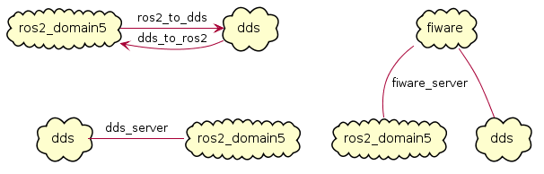
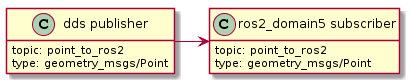
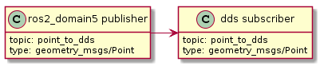
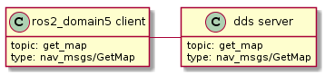

.. role:: raw-html(raw)
    :format: html

.. _yaml_config:

YAML Configuration
==================

The first part of this section provides a general overview of all the parameters available to configure
and launch an *Integration Service* instance. To get more detailed information on every subsection,
please have a look at the list below:

* :ref:`types_definition`
* :ref:`systems_definition`
* :ref:`routes_definition`
* :ref:`topics_definition`
* :ref:`services_definition`
* :ref:`remapping`

The *Integration Service* can be configured during runtime by means of a dedicated **YAML** file.
This configuration file must follow a specific syntax, meaning that it is required that a number
of compulsory section are opportunely filled for it to successfully configure and launch
an *Integration Service* instance, while others are optional. Both kinds are listed and reviewed below:

* :code:`types`: *(optional)*: It allows to list the `IDL <https://www.omg.org/spec/IDL/4.2/About-IDL/>`_
  types used by the *Integration Service* to later define the topics and services types which will
  take part in the communication process.

  This field can be omitted for certain *Integration Service* instances where one or more *System
  Handles* already include(s) static type definitions and their corresponding transformation libraries
  (*Middleware Interface Extension* or *mix* files).

  .. code-block:: yaml

    types:
      idls:
        - >
          #include <GoodbyeWorld.idl>
          struct HelloWorld
          {
            string data;
            GoodbyeWorld bye;
          };
      paths: [ "/home/idl_files/goodbyeworld/" ]

  Several parameters can be configured within this section:

    * :code:`idls`: List of IDL type definitions that can be directly embedded within the configuration file.
      If the :code:`types` section is defined, this subsection is mandatory. The type can be entirely defined within the YAML file,
      or can be included from a preexisting IDL file; for the latter,
      the system path containing where the IDL file is stored must be placed into the :code:`paths` section described below.

    * :code:`paths` *(optional):* Using this parameter, an existing IDL type written in a separate file can be included within the *Integration Service* types section.
      If the IDL path is not listed here, the previous subsection :code:`#include` preprocessor directive will fail.

  For more details on this section, please refer to the :ref:`types_definition` subsection of this page.

  :raw-html:` `

* :code:`systems`: Specifies which middlewares will be involved in the communication process, allowing
  to configure them individually.

  Some configuration parameters are common for all the supported middlewares within the
  *Integration Service* ecosystem; while others are specific of each middleware. To see which
  parameters are relevant for a certain middleware, please refer to its dedicated *README* section
  in its corresponding GitHub repository, under the name of :code:`https://github.com/eProsima/<MW_NAME>-SH`.

  .. code-block:: yaml

    systems:
      foo: { type: foo }
      bar: { type: bar, types-from: foo }

  In relation to the common parameters, their behaviour is explained in the following section:

    * :code:`type`: Middleware or protocol kind. To date, the supported middlewares are: *fastdds*, *ros1*, *ros2*, *fiware*, *websocket_server* and *websocket_client*.
      There is also a *mock* option, mostly used for testing purposes.

    * :code:`types-from` *(optional)*: Configures the types inheritance from a given system to another.
      This allows to use types defined within *Middleware Interface Extension* files for a certain middleware into another middleware,
      without the need of duplicating them or writing an equivalent IDL type for the rest of systems.

  For more details on this section, please refer to the :ref:`systems_definition` subsection of this page.

  :raw-html:` `

* :code:`routes`: In this section, a list must be introduced, corresponding to which bridges are needed by
  *Integration Service* in order to fulfill the intercommunication requirements
  for a specific use case.

  At least one route is required; otherwise, running *Integration Service* would be useless.

  .. code-block:: yaml

    routes:
      foo_to_bar: { from: foo, to: bar }
      bar_to_foo: { from: bar, to: foo }
      foo_server: { server: foo, clients: bar }
      bar_server: { server: bar, clients: foo }

  There are two kinds of routes, corresponding to either a publication/subscription paradigm or a
  server/client paradigm:

    * :code:`from`-:code:`to`: Defines a route **from** one (or several) system(s) **to** one (or several) system(s).
      A :code:`from` system expects to connect a publisher user application with a subscriber user application in the :code:`to` system.

    * :code:`server`-:code:`clients`: Defines a route for a request/reply architecture in which there are one or several
      **clients** which forward request petitions and listen to responses coming from a **server**,
      which must be unique for each service route.

  For more details on this section, please refer to the :ref:`routes_definition` subsection of this page.

  :raw-html:` `

* :code:`topics`: Specifies the topics exchanged over the :code:`routes` listed above corresponding to the
  publication-subscription paradigm. The topics must be specified in the form of a YAML dictionary,
  meaning that two topics can never have the same name.

  For each topic, some configuration parameters are common for all the supported middlewares within the
  *Integration Service* ecosystem; while others are specific of each middleware. To see which topic
  parameters must/can be configured for a certain middleware, please refer to its dedicated *README* section
  in its corresponding GitHub repository, under the name of :code:`https://github.com/eProsima/<MW_NAME>-SH`.

  .. code-block:: yaml

    topics:
      hello_foo:
        type: HelloWorld
        route: bar_to_foo
      hello_bar:
        type: HelloWorld
        route: foo_to_bar
        remap: { bar: { topic: HelloBar } }

  In relation to the common parameters, their behaviour is explained below:

  * :code:`type`: The topic type name. This type must be defined in the :code:`types` section of the YAML
    configuration file, or it must be loaded by means of a :code:`Middleware Interface Extension` file
    by any of the middleware plugins or *System Handles* involved in the communication process.

  * :code:`route`: Communication bridge to be used for this topic. The route must be one among those defined in the
    :code:`routes` section described above.

  * :code:`remap` *(optional):* Allows to establish equivalences between the **topic** name and its **type**,
    for any of the middlewares defined in the used route. This means that the topic name and
    type name may vary in each user application endpoint that is being bridged, but,
    as long as the type definition is equivalent, the communication will still be possible.

  For more details on this section, please refer to the :ref:`topics_definition` subsection of this page.

  :raw-html:` `

* :code:`services`: Allows to define the services that *Integration Service* will be in charge of
  bridging, according to the service :code:`routes` listed above for the client/server paradigm.
  The services must be specified in the form of a YAML dictionary, meaning that two services can
  never have the same name.

  For each service, some configuration parameters are common for all of the supported middlewares
  within the *Integration Service* ecosystem; while others are specific of each middleware.
  To see which parameters must/can be configured for a certain middleware in the context of a service
  definition, please refer to its dedicated *README* section in its corresponding GitHub repository,
  under the name of :code:`https://github.com/eProsima/<MW_NAME>-SH`.

  .. code-block:: yaml

    services:
      serve_foo:
        request_type: FooRequest
        reply_type: FooReply
        route: foo_server
      serve_bar:
        request_type: BarRequest
        reply_type: BarReply
        route: bar_server
        remap: { foo: { request_type: bar_req, reply_type: bar_repl, topic: ServeBar } }

  Regarding the common parameters, they differ slightly from the :code:`topics` section:

  * :code:`type` *(optional):* The service type. As services usually are composed of a request and a reply, this field
    only makes sense for those services which consist solely of a request action with no reply.
    Usually, within the :code:`services` context, it is not used at all.

  * :code:`request_type`: The service request type. This type must be defined in the :code:`types` section of the YAML
    configuration file, or must be loaded by means of a :code:`Middleware Interface Extension` file
    by any of the middleware plugins, or *System Handles*, involved in the communication process.

  * :code:`reply_type`: The service reply type. This type must be defined in the :code:`types` section of the YAML
    configuration file, or must be loaded by means of a :code:`Middleware Interface Extension` file
    by any of the middleware plugins, or *System Handles*, involved in the communication process.

  * :code:`route`: Communication bridge to be used for this service. The route must be one among those defined in the
    :code:`routes` section described above and must be a route composed of a *server* and one or more *clients*.

  * :code:`remap` *(optional):* Allows to establish equivalences between the **service** name (*topic* field) and its
    **request and reply type**, for any of the middlewares defined in the used route.
    This means that the service name and types names may vary in each user application endpoint
    that is being bridged, but, as long as the type definition is equivalent, the communication will still be possible.

  For more details on this section, please refer to the :ref:`services_definition` subsection of this page.

  :raw-html:` `

.. _types_definition:

Types definition
^^^^^^^^^^^^^^^^

Some *System Handles* have the ability to inform *Integration Service* of the types definition
(using `XTypes <https://github.com/eProsima/xtypes>`__) that they can use.
The *System Handles* of *ROS 1* and *ROS 2* are examples of this.
Nevertheless, there are cases where the *System Handle* is not able to retrieve the type specification
(*websocket*, *mock*, *dds*, *fiware*, ...) that it needs for the communication.

In those cases, there are two ways to pass this information to the *System Handle*:

- Using the :code:`types-from` property, that *imports* the types specification from another system.
- Specifying the type yourself by embedding an IDL into the YAML.

Regarding the second option, the IDL content can be provided in the YAML either directly, as follows:

.. code-block:: yaml

    types:
        idls:
            - >
                struct name
                {
                    idl_type1 member_1_name;
                    idl_type2 member_2_name;
                };

or by inclusion of a :code:`paths` field, that can be used to provide the preprocessor with a list of paths where
to search for IDL files to include into the IDL content. The syntax in this case would be:

.. code-block:: yaml

    types:
        idls:
            - >
                #include <idl_file_to_parse.idl>

            paths: [ idl_file_to_parse_path ]

Notice that these two approaches can be mixed.

The name for each type can be whatever the user wants, with the two following rules:

    1. The name cannot have spaces in it.
    2. The name must be formed only by letters, numbers and underscores.

Note: a minimum of a structure type is required for the communication.

For more details about IDL definition, please refer to
`IDL documentation <https://www.omg.org/spec/IDL/4.2/PDF>`__.

The following is an example of a full configuration defining a :code:`dds`-:code:`fiware` communication using the types
definition contained in the :code:`idls` block.

.. code-block:: yaml

    types:
        idls:
            - >
                struct Stamp
                {
                    int32 sec;
                    uint32 nanosec;
                };

                struct Header
                {
                    string frame_id;
                    stamp stamp;
                };

    systems:
        dds: { type: dds }
        fiware: { type: fiware, host: 192.168.1.59, port: 1026 }

    routes:
        fiware_to_dds: { from: fiware, to: dds }
        dds_to_fiware: { from: dds, to: fiware }

    topics:
        hello_dds:
            type: "Header"
            route: fiware_to_dds
        hello_fiware:
            type: "Header"
            route: dds_to_fiware

.. TODO_1: Note that the publisher and subscriber in the DDS world need to be configured with a compatible IDL.
    That means that the type definition may differ between them.

.. TODO_2: In that case, some `QoS policies <https://github.com/eProsima/xtypes#type-consistency-qos-policies>`__ will
    enable to try to convert the type. IS will notify the user with the different QoS policies enabled in
    the communication.

.. _systems_definition:

Systems definition
^^^^^^^^^^^^^^^^^^

A *System Handle* may need additional configuration that should be defined in its :code:`systems` entry as a YAML map.
Each entry of this section represents a middleware involved in the communication, and corresponds to an instance of
a *System Handle*.
All *System Handles* accept the :code:`type` and :code:`types-from` options in their :code:`systems` entry.
If :code:`type` is omitted, the key of the YAML entry will be used as :code:`type`.

.. code-block:: yaml

    systems:
        dds:
        ros2_domain5: { type: ros2, domain: 5, node_name: "ros_node_5" }
        fiware: { host: 192.168.1.59, port: 1026 }

The snippet above will create three *System Handles*:

* A *DDS* *System Handle* with default configuration.
* A *ROS 2* *System Handle* named :code:`ros2_domain` with :code:`domain = 5` and
  :code:`node_name = "is_5"`.
* A *Fiware* *System Handle* with :code:`host = 192.168.1.59` and :code:`port = 1026`.

The *System Handles* currently available for *Integration Service* are listed in a table that you can find in the
:ref:`shs` section of this documentation.

A new *System Handle* can be created by implementing the desired :code:`SystemHandle` subclasses to
add support to any other protocol or system.
For more information consult the :ref:`sh` section.

.. _routes_definition:

Routes definition
^^^^^^^^^^^^^^^^^

This section allows enumerating the bridges between the systems that *Integration Service* must manage.
To achieve bidirectional communication, both ways must be specified.

:code:`routes` definition keywords are specific depending on whether the route is
defining a *publisher/subscriber* path (:code:`from`-:code:`to`) or a *service/client* communication
path (:code:`server`-:code:`client`). For example:

.. code-block:: yaml

    routes:
        ros2_to_dds: { from: ros2_domain5, to: dds }
        dds_to_ros2: { from: dds, to: ros2_domain5 }
        dds_server: { server: dds, clients: ros2_domain5 }
        fiware_server: { server: fiware, clients: [ dds, ros2_domain5 ] }

This YAML defines the following routes:

* The route :code:`ros2_to_dds` defines a :code:`ros2_domain5` publisher with a :code:`dds` subscriber.
* The route :code:`dds_to_ros2` defines a :code:`dds` publisher with a :code:`ros2_domain5` subscriber.
* Having the routes :code:`ros2_to_dds` and :code:`dds_to_ros2` results in a bidirectional communication
  between the :code:`ros2_domain5` and :code:`dds` systems.
* The route :code:`dds_server` defines a :code:`dds` server with only one client: :code:`ros2_domain5`.
* The route :code:`fiware_server` defines a :code:`fiware` server with two clients: :code:`ros2_domain5` and
  :code:`dds`.

.. _topics_definition:

Topics definition
^^^^^^^^^^^^^^^^^

Each :code:`system` is able to *publish/subscribe* to each other’s :code:`topics`.
These *publish/subscription* policies are set directly in the YAML
configuration file by specifying the topic :code:`type` and its :code:`route` (which :code:`system` is
the publisher and which is the subscriber) as the main parameters:

.. code-block:: yaml

    topics:
        point_to_ros2:
            type: "geometry_msgs/Point"
            route: dds_to_ros2
        point_to_dds:
            type: "geometry_msgs/Point"
            route: ros2_to_dds

* The topic :code:`point_to_ros2` will create a :code:`dds` publisher and a :code:`ros2_domain5` subscriber.

* The topic :code:`point_to_dds` will create a :code:`ros2_domain5` publisher and a :code:`dds` subscriber.

If a custom *System Handle* needs additional configuration regarding the :code:`topics`, it can
be added to the topic definition as new map entries.

.. _services_definition:

Services definition
^^^^^^^^^^^^^^^^^^^

:code:`service` definition is very similar to :code:`topics` definition, with the difference that in this case
:code:`routes` can only be chosen among the ones specified with the *server/client*
syntax; also, the :code:`type` entry for these fields usually follows the *request/response*
model, pairing each of them with the corresponding :code:`route`, depending on
which :code:`system` acts as the server and which as the client(s).

.. code-block:: yaml

    services:
        get_map:
            type: "nav_msgs/GetMap"
            route: dds_server
        update_position:
            type: "Position"
            route: fiware_server

.. _comment_1: Once the branch "feature/dds_methods" is merged, add documentation about request and reply types.

* The service :code:`get_map` will create a :code:`dds` server and a :code:`ros2_domain5` client.

* The service :code:`update_position` will create a :code:`fiware` server, and :code:`dds` and :code:`ros2_domain5`
  clients.

.. image:: images/update_position.png
   :align: center

If a custom *System Handle* needs additional configuration regarding the :code:`services`, it can
be added in the service definition as new map entries.

.. note:: If the :code:`type` field is defined, as in the example above, this :code:`type` will be taken into consideration
  as the **request type**. If a differentiation must be done for those services which allow to differenciate between
  **request** and **reply** types, the fields :code:`request_type` and :code:`reply_type` must be used instead.

.. _remapping:

Remapping
^^^^^^^^^

Sometimes, :code:`topics` or :code:`types` from one system are different from those managed by the systems with which
it is being bridged.
To solve this, *Integration Service* allows to remap :code:`types` and :code:`topics`
in the *Topics definition* and in the *Services definition*.

.. code-block:: yaml

    services:
        set_destination:
            type: "nav_msgs/Position"
            route: dds_server
            remap:
                dds:
                    type: "dds/Destination"
                    topic: "command_destination"

In this :code:`services` entry, the :code:`remap` section defines the :code:`type` and the :code:`topic` that must be
used in the :code:`dds` system, instead of the ones defined by the service definition, which will be used by the
:code:`ros2_domain5` system.

.. image:: images/remap.png
    :align: center

:raw-html:` `
